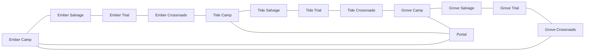
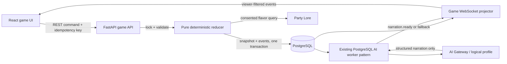

# AI Board Game — product and system design

Status: implementation-ready design, no production code or migration applied

Selected game: **The Last Portal / Son Portal**

Players: **exactly 3**, no bots in v1
Target session: **20–45 minutes**, 8 rounds / 24 player turns maximum

## 1. Five concepts designed for three players

| Concept | Core loop | Why it works specifically with 3 | Solo-dev cost |
|---|---|---|---|
| **Son Portal** | Explore a 12-tile ring, claim three sigils, charge a shared portal, score personal Fame | Three symmetric regions give each player an opening lane; the shared portal creates contact; two-player pacts leave a visible third player but expire every round | **Low**: fixed graph, small card/effect vocabulary, no spatial combat |
| Üç Kaptan, Tek Gemi | Rotate captain/engineer/navigator roles while repairing a shared ship and collecting Prestige | Three roles are always filled; command votes naturally avoid even-number ties | Medium: role-specific UI and many interdependent systems |
| Zindan İhaleleri | Bid for rooms, routes and relic contracts in a shared dungeon | Three-way sealed bids are legible; every auction has a meaningful middle bidder | Medium: economy is sensitive and needs extensive simulations |
| Kayıp Sunucu | Repair network nodes while secretly optimizing personal service objectives | Three specialists create useful cooperation without a full party-role roster | Medium-high: network state and cascading failures are harder to teach |
| Efsane Pazarı | Collect story sets, trade rumors and trigger public festivals | Three players create a functioning trade market without analysis paralysis | Medium: content volume and set balance dominate development time |

**Selection: Son Portal.** It has the smallest deterministic rules surface, needs no pathfinding beyond adjacency, produces cooperation/conflict/betrayal naturally, and remains fully playable when the AI Gateway is offline. Its three symmetric regions are easy to test for seat fairness, while a shared center ensures it does not feel like three parallel solitaire games.

## 2. Game rules

### Goal and outcome

The group tries to deposit the three regional Sigils and add three Portal Charge before Chaos reaches 12 or round 8 ends. The group outcome is either:

- `PORTAL_OPENED`: the cooperative objective succeeded.
- `ROUGH_ESCAPE`: Chaos reached 12 or round 8 ended before activation.

There is always one individual champion: the player with the highest final Fame. Group outcome and individual winner are shown separately so cooperation matters without leaving the match without a clear result.

### Setup

1. The server pins `rulesVersion`, `contentVersion`, theme and locale.
2. The engine builds a fixed 13-tile graph: 12 outer tiles plus the center Portal. Cosmetic names/art may vary by theme; adjacency and mechanics do not.
3. Seats 0, 1 and 2 start at Camps `E0`, `T0` and `G0`, spaced equally around the ring.
4. Each player starts with Energy 3, Scrap 1, Fame 0, Shield 0 and Momentum 0.
5. Chaos starts at 2; Portal Charge starts at 0. The Ember, Tide and Grove Trial tiles each contain one distinct Sigil.
6. The deterministic RNG shuffles pinned Opportunity, World, Pact and Twist decks. The seed commitment is public; the seed is encrypted until game end.
7. Each player privately receives two objective offers and selects one. Unselected objectives are discarded without being revealed.
8. A committed RNG result chooses the first seat. First seat rotates one position each round.

### Board

Each region contains four outer tiles in this order: Camp → Salvage → Trial → Crossroads. The three Crossroads connect the regions into one ring. Every Camp also connects to the center Portal.



Tile behavior:

- **Camp:** `REST` gives 2 Energy, capped at 6. A Camp is also a relay for entering the Portal.
- **Salvage:** once per player per round, `SCAVENGE` resolves its face-up reward pattern. It gives no random unknown effect.
- **Trial:** `ATTEMPT_TRIAL` may claim the region's Sigil. A player can try each Trial once per round.
- **Crossroads:** draw an Opportunity or enter a simultaneous contest when its face-up prize is active.
- **Portal:** deposit carried Sigils, spend Scrap to add Charge, and meet for late-game cooperation.

### Turn and round structure

- A round contains one turn per player in rotating seat order.
- A turn begins with 2 Action Points (AP). A player may repeat legal actions unless the action says otherwise, then uses `END_TURN` or automatically ends at 0 AP.
- The active-turn clock is 75 seconds. A disconnected player has a 90-second grace period. After it, the server records `SAFE_TIMEOUT`, spends no resources, makes no strategic choice and ends the turn.
- After all three turns, the deterministic World Phase draws/resolves one World card, increases Chaos by 1, expires statuses/pacts, awards catch-up Momentum and checks the ending condition.
- AI narration is never part of this critical path.

### Resources

| Resource | Range | Purpose |
|---|---:|---|
| Energy | 0–6 | Trial boosts, sealed Crossroads bids and some cards |
| Scrap | 0–6 | Portal Charge, trades and card costs |
| Fame | 0–20 during play | Individual score; it grants no mechanical power |
| Shield | 0–2 | Cancel one resource loss or negative status, then consume it |
| Momentum | 0–1 | Catch-up token: add +1 to a Trial roll or make one `MOVE` cost 0 AP |

Sigils are tracked items, not spendable resources. They cannot be discarded or stolen.

### Core actions

| Action | Cost | Resolution |
|---|---:|---|
| `MOVE` | 1 AP | Move to one adjacent tile. Momentum may reduce exactly one move to 0 AP. |
| `SCAVENGE` | 1 AP | Take the current deterministic Salvage reward; once per player/tile/round. |
| `REST` | 1 AP | At a Camp, gain 2 Energy up to the cap. |
| `ATTEMPT_TRIAL` | 1 AP | Roll committed d6, optionally spend 0–2 Energy before the roll; total 5+ succeeds. Failure costs 1 Energy if available and adds 1 Chaos. |
| `ASSIST_TRIAL` | reaction | A co-located non-active player may spend 1 Energy to add +1 before the roll. On success both gain 1 contribution point and the assistant gains 1 Fame. One assistant maximum. |
| `DEPOSIT_SIGIL` | 1 AP | At the Portal, deposit a carried Sigil; gain 2 Fame and 1 contribution point. |
| `CHARGE_PORTAL` | 1 AP + 1 Scrap | At the Portal, add 1 Charge (maximum 3); gain 1 Fame and 1 contribution point. |
| `DRAW_OPPORTUNITY` | 1 AP | At Crossroads, draw to a hand limit of 3. |
| `CONTEST_CROSSROADS` | 1 AP | Join the face-up prize contest; all present participants make a sealed 0–2 Energy bid, then committed d6 + bid decides. Only the shared prize is won; nothing is stolen. |
| `TRADE` | 1 AP | Co-located players submit matching offers. Energy, Scrap or cards only; never Fame, objectives or Sigils. Disabled once the Portal opens. |
| `FORM_PACT` | 1 AP | Two co-located eligible players accept a public Pact mission until round end. |
| `PLAY_CARD` | printed AP/cost | Run its fixed effect template and discard it. |
| `END_TURN` | 0 AP | End voluntarily. |

The UI does not send arbitrary action types. It renders the engine's `list_legal_actions` response and returns one action ID, its opaque action token and schema-bounded parameters.

### Trials and committed randomness

Randomness is server authoritative and verifiable:

1. At setup, the server samples a 256-bit seed and publishes `SHA-256(seed)`.
2. Each roll/card shuffle derives bytes from `HMAC-SHA256(seed, game_id || counter || purpose)`.
3. Rejection sampling avoids modulo bias; counter and purpose are appended to the public event log.
4. At game end, the seed is revealed and the client can replay every random result.

A refresh, retry or AI call can never reroll. The action's idempotency key returns the original result.

### Cards and events

- **Opportunity cards** are small personal tools: bounded resource exchange, Shield, movement or a risk/reward check.
- **World cards** affect symmetric board properties, resource bands or all players. They do not name a target player.
- **Pact cards** define a one-round joint mission and its honor/betray resolution.
- **Twist cards** appear at the end of rounds 3 and 6. Their mechanics are selected at setup from a balanced built-in set; the LLM may only reskin their presentation.
- Hand limit is 3. If a draw would exceed it, the owner privately chooses a discard before taking another game action.

### Cooperation, alliances and betrayal

Assistance, Portal work and Pacts create cooperation without permanent teams.

- A Pact has exactly two members, lasts only to the end of the current round and is public.
- A player may be in one active Pact at a time. The same pair may complete at most two Pacts per game.
- The mission asks both members for a bounded contribution or board condition. If honored, each gains 2 Fame; neither can transfer Fame to the other.
- A member may betray only during Pact resolution and at most once per game. The betrayer receives 2 Scrap but loses 1 Fame and becomes `DISTRUSTED` through the next round. The betrayed player receives 1 Shield and 1 Fame. The Pact ends immediately.
- `DISTRUSTED` prevents forming a Pact; it never prevents ordinary movement or Portal contribution.

Betrayal therefore creates a visible story beat and resource tradeoff, but it cannot eliminate a player, steal a Sigil, erase a turn or decide the whole match in one click.

### Conflict

There are no attacks and no player elimination. Crossroads contests are optional, simultaneous and compete only for a neutral face-up reward. Each participant's bid stays hidden until all bids arrive or the 30-second choice timer expires; a missing bid becomes 0. Ties use the same committed RNG stream. Direct player targeting is deliberately absent in v1.

### Secret objectives

Every objective is worth exactly 3 Fame and refers only to its owner's conduct. Initial set:

- visit all three regions;
- assist successful Trials twice;
- play two different Opportunity effect templates;
- contribute twice to the Portal;
- finish with at least 2 Energy and 2 Scrap;
- succeed at a Trial without spending Energy.

Objectives never require harming, betraying or helping a named opponent. Only the owner sees progress details during play. All selected objectives reveal at final scoring.

### End, scoring and ties

The game ends after the current round when the Portal has three distinct deposited Sigils and three Charge. It ends immediately after a World Phase that reaches Chaos 12, or after round 8 otherwise.

Final Fame is current Fame plus 3 for a completed selected objective. `PORTAL_OPENED` gives every player a ceremonial 2-point group bonus shown separately; it is not added to competitive Fame because an equal bonus cannot change ranking. `ROUGH_ESCAPE` adds no competitive penalty for the same reason.

Tie breakers, in order:

1. more contribution points;
2. completed objective (normally 0 or 1);
3. more remaining Energy + Scrap;
4. fewer betrayals;
5. one published committed-RNG result using the original seed.

The final fallback is auditable, independent of seat order and extremely rare.

### Comeback and anti-snowball rules

- At each round start, the sole lowest-Fame player gains Momentum. If several players tie for last, each gains it; if all tie, nobody does.
- A player with both 0 Energy and 0 Scrap receives 1 Energy at round start.
- Fame never improves rolls, hand size, movement or income.
- Resource and hand caps prevent compounding stockpiles.
- Direct attacks, Fame transfers, Sigil theft and permanent alliances do not exist.
- World events address everyone or deterministic board/resource conditions, never “the leader.”
- A player can assist only one Trial per round, preventing a two-player engine from repeatedly excluding the third.
- Trades and new Pacts close when the Portal opens, limiting final-turn kingmaking.
- Players cannot target the score leader because no generic targeted harm action exists.
- If a Sigil carrier disconnects for the rest of the match, the Sigil remains attached through timeouts; after two complete missed rounds it returns to its Trial with no Fame loss. This prevents hostage state without rewarding disconnection.

## 3. Deterministic engine versus AI Game Master



**Engine owns:** setup, adjacency, legal actions, action costs, timers, RNG, deck order, choices, resource caps, statuses, card effects, objective progress, privacy projection, scoring, end conditions and persistence.

**LLM owns:** theme-consistent titles/descriptions, short narration of committed public events, round recaps and final recap. It may explain already-known rules in neutral language.

**LLM never owns:** state, legality, target selection, effect numbers, dice, card order, hidden information, scoring, timeout behavior or winner selection.

Mutation tools in [`tool-contract.ts`](./tool-contract.ts) exist for an orchestrator boundary, not as free model authority. They require single-use capabilities that bind exact arguments. In the preferred implementation, ordinary player commands call the engine directly and the narrator receives read-only tools only.

## 4. Content generation without unfair effects

### MVP policy

The engine selects an effect template and exact parameters first using the pinned content pack and committed RNG. The model receives that immutable effect and returns only:

```json
{
  "title": "Fısıldayan Pusula",
  "description": "Pusula yolu değil, en kötü fikri gösteriyor.",
  "effect_template": "RISK_REWARD_CHECK",
  "parameters_echo": {
    "difficulty": 4,
    "success_energy": 2,
    "failure_energy": -1
  },
  "lore_reference_ids": []
}
```

`parameters_echo` must byte-for-byte normalize to the engine input. The model cannot change it. On mismatch, unsafe text, schema failure or timeout, the built-in localized title/description is used.

### Later controlled-proposal mode

The LLM may propose parameters only inside an engine-provided balance envelope. The validator then checks JSON schema, effect allowlist, numeric ranges, target scope, total reward budget, current board feasibility and information safety. It either normalizes to a known-safe instance or rejects; it never executes model-authored code.

| Template | Allowed shape | Key bounds |
|---|---|---|
| `RESOURCE_DELTA` | one player gains/loses one resource | absolute delta ≤2; no Fame loss |
| `RISK_REWARD_CHECK` | optional cost, d6 threshold, success/failure | difficulty 3–5; reward budget ≤3; failure budget ≤2 |
| `CHOICE_RESOURCE_OR_FAME` | owner chooses resources or 1 Fame | resource total ≤2; Fame exactly 1 |
| `COOPERATIVE_CHECK` | two present players contribute to one check | each contribution ≤1; equal reward opportunity |
| `STATUS_TRADEOFF` | safe status for a bounded reward | allowlisted status; duration 1–2 rounds |
| `TILE_SHORTCUT` | move along engine-computed safe destinations | no Trial/Portal deposit bypass; ≤2 edges |
| `PACT_MISSION` | two-player condition and standard resolution | fixed honor/betray payout only |

Hard rejections include arbitrary scripts/expressions, direct Fame transfer/loss, changing Chaos by more than 1, touching Sigil ownership, targeting a named player, revealing secrets, extra turns, permanent status, resource values outside caps or effects impossible in the current state.

Generated sessions, themed dilemmas and lore-based cards are cosmetic skins over these templates. Cache key: rules/content version + effect canonical hash + locale + theme + approved lore IDs + prompt version. AI unavailability never prevents play.

## 5. Multiplayer architecture

### Why WebSockets

The game needs turn changes, sealed-choice completion, reconnects and personalized private events within seconds. Pure polling is wasteful and feels sluggish; WebSockets are the primary delivery path. REST remains the command/source-of-truth path, while `GET events?after=sequence` provides a 3-second polling fallback and gap recovery.

This feature should be a Core bounded context, not a sandbox plugin: it requires durable secret state, transactions, per-viewer projections and authorization. The existing chance-game service demonstrates server-owned hidden choices and row locking; the existing gateway demonstrates connection lifecycle. Game events use their own room-scoped manager instead of the global presence gateway.

### Lobby and invitation flow

1. A server member creates a room in a server channel and becomes lobby host.
2. The API returns an 8-character one-time-visible invite code. Only its server-peppered hash is stored; it expires in 30 minutes and can be rotated/revoked.
3. Joining requires authentication, membership in the same Nexus server, a valid code and an available seat. Transactions lock the room so the third seat cannot be overbooked.
4. Exactly three distinct players select one secret objective and become ready.
5. The host starts against `lobbyRevision`; the transaction rechecks three occupied seats and readiness. No late join or spectator receives secret data in v1.

The room is persistent. Host status is lobby administration only, not gameplay authority. Before start, if the host leaves, the earliest joined remaining player becomes host. After start, the server owns the game and play continues even if the display host disconnects; the earliest connected player is marked UI host for presentation only.

### Commands, synchronization and reconnect

- Every action POST carries `Idempotency-Key`, `expectedRevision`, the listed `actionId` and its action token.
- The API locks the current state row, runs a pure reducer, appends a new immutable snapshot and ordered events in one transaction, then broadcasts after commit.
- Each socket is opened with a 60-second, single-use game ticket minted over authenticated REST. Long-lived JWTs are not placed in URLs.
- On `hello`, the client sends last sequence/revision. Up to 500 authorized events are replayed; larger gaps receive a fresh viewer-specific snapshot.
- Public and private events share ordering but are projected per connection. An event for player A's objective is never put on B's socket and never cached in a public room object.
- On reload, REST snapshot is authoritative. A duplicated/late socket for the same account is closed or replaced, following the repository's current connection-manager behavior.
- Multiple backend instances publish committed game event IDs through Redis/pub-sub when horizontally scaled; PostgreSQL remains source of truth. MVP can run a single process without Redis.

Contracts and endpoint map are in [`realtime-contract.ts`](./realtime-contract.ts). Database DDL is in [`schema.sql`](./schema.sql).

## 6. Minimal fun web UI

One responsive route, `/servers/:serverId/games/:gameId`, with five regions:

1. **Top strip:** round, Chaos 2/12, Portal Charge 1/3, deposited Sigils, connection state and turn timer.
2. **Center board:** compact 13-node SVG/CSS graph; three colored pawns; selected tile panel. No 3D engine or canvas framework required.
3. **Player rail:** avatar/name, public Fame/resources/statuses, active-turn glow and private objective card only on the viewer's own panel.
4. **Action tray:** large buttons generated only from legal actions. Costs and predicted deterministic constraints are visible before confirmation. Sealed choices use a focused modal.
5. **Story log:** mechanical sentence first, optional AI flavor beneath it, with a “narration delayed” placeholder that never blocks controls.

Accessibility: never encode players/resources by color alone, keyboard-focusable board/actions, reduced-motion mode, text alternative for the board graph, 44px touch targets, live-region announcements for turn changes without reading hidden content. Mobile stacks the board above a sticky action tray; story log becomes a drawer.

Fun polish after validation: short pawn movement, dice/result animation under 700ms with skip, portal charge pulse, pact ribbon, restrained sound toggles. Mechanical state appears immediately; animation cannot postpone command availability.

## 7. Party Lore, Meme and Highlight integration

Party Lore is opt-in flavor only. The game requests at most three consented, low-sensitivity references scoped to participating players and `BOARD_GAME_FLAVOR`. It receives aliases/safe summaries, never raw messages. Lore cannot select an effect, player, reward, objective, score or target. If consent changes, cached content is invalidated and fallback wording is used.

At game end the engine emits a privacy-safe `GameCompleted` event containing public turning points, scores and approved narration references:

- **Highlight Generator:** can make a recap timeline/video from public event IDs; private objectives appear only after their official reveal.
- **Meme Generator:** can offer an opt-in meme using a public game moment and consented media. No automatic posting.
- **Party Lore:** may ingest a compact public match memory only under its own consent/sensitivity/deduplication policy; the board game does not write raw logs into lore.

These consumers are asynchronous. Their failure never rolls back or delays game completion.

## 8. PostgreSQL model

[`schema.sql`](./schema.sql) defines all requested tables:

- `game_rooms`, `game_players`, `game_states`, `game_turns`, `game_actions`;
- `game_cards`, `game_events`, `secret_objectives`, `generated_content`, `game_results`.

The current state is an immutable revisioned snapshot. `game_actions` is the idempotent command ledger; `game_events` is the ordered, privacy-labelled audit/replay stream. Hidden engine JSON, RNG ciphertext, hands and secret objectives never enter generic API serializers. Rules and content versions are pinned per room so a deployment cannot change a running or replayed game.

## 9. Implementation roadmap

### Phase 0 — balancing harness and CLI prototype

- Implement `last_portal_v1` as pure Python dataclasses/functions with seeded RNG abstraction.
- Add a terminal UI for three local humans plus scripted random/greedy policies for simulation.
- Run at least 100,000 seeded matches; measure seat win rates, group success, round length, action distribution, score spread, comeback rate and tie-break frequency.
- Gate: each seat win rate within ±3 percentage points of 33.3%, group success 45–70%, final RNG tie-break under 1%.

### Phase 1 — deterministic engine

- Port stable rules to a versioned `backend/app/games/last_portal_v1` package.
- Add pure legal-action generator, reducer, effect interpreter, viewer projector and replay verifier.
- Add PostgreSQL models/Alembic migration, command transactions, idempotency and API authorization.
- Gate: property/replay/privacy/concurrency suites pass; engine plays fully with AI disabled.

### Phase 2 — web multiplayer

- Lobby/invite/ready/start, viewer-safe REST views, action endpoints, game WebSocket, reconnect replay and polling fallback.
- Build the minimal React board/action tray/log and mobile layout.
- Gate: three browsers can refresh, disconnect and resume without duplicate turns or hidden-data leakage.

### Phase 3 — AI narration

- Route logical `board_game_narrator` through the upgraded AI Gateway provider abstraction.
- Reuse the PostgreSQL leasing/retry worker pattern; add structured output validation and deterministic fallbacks.
- Gate: model outage adds zero gameplay downtime and no narration contradicts golden mechanical summaries.

### Phase 4 — generated event skins

- Precompute cosmetic card/event wording over fixed effects; later trial the bounded proposal mode behind a feature flag.
- Add rejection/normalization telemetry and content moderation.
- Gate: generated content passes effect identity and hidden-information tests.

### Phase 5 — Party Lore

- Add explicit per-session lore toggle, approved flavor retrieval, cache invalidation and safe attribution rules.
- Gate: revoked/absent lore produces equivalent mechanics and no residual client-visible reference.

### Phase 6 — polish and downstream media

- Animation/audio/accessibility pass, analytics, end recap, opt-in Highlight/Meme hooks and operational dashboards.
- Tune only by new pinned rules/content versions; never edit an active version in place.

## 10. Testing strategy

### Unit and property tests

- Board is connected; Camps are symmetric; exactly three Trials and Sigils exist.
- Resources always remain within caps; AP never goes negative; Fame cannot pay costs.
- Every returned legal action can apply once at the same revision; every unlisted action rejects.
- A reducer is deterministic for equal state/command/RNG input and never reads wall clock/network/model.
- Exactly one current snapshot exists; revision advances once per applied command.
- Sigils cannot duplicate, disappear, transfer through trade or deposit twice.
- Portal opens only at 3 distinct Sigils + 3 Charge.
- Pacts have two members, expire, respect pair/player caps and use fixed betrayal payouts.
- Objective templates never contain target player IDs or negative opponent predicates.

Use property-based generated action sequences to assert invariants after every transition and serialize/reload state between random steps.

### Privacy and security tests

- A player view/socket never contains another hand, objective, sealed bid, choice token, RNG seed or `PLAYER:other` event.
- Server membership is rechecked on create/join/view/action/socket-ticket.
- Invite codes are hashed, expiring, rate-limited and invalid after rotate/start/full room.
- Capability alteration, expiry, cross-player use, cross-game use and replay all reject.
- Stale revisions return conflict plus current revision without partial mutation.
- Prompt injection inside card/lore text cannot invoke tools, expose state or alter output schema.
- LLM context snapshots contain no private fields; generated text is length/schema/safety validated.

### Concurrency and recovery tests

- Two third-seat joins race: exactly one commits.
- Double click/retry with one idempotency key returns the original action result and RNG value.
- Two actions at one revision: at most one applies.
- Process dies before commit: nothing broadcasts; dies after commit/before broadcast: reconnect/event replay recovers.
- Old socket replacement cannot mark the new connection offline.
- Gap >500 events yields a correct viewer snapshot; smaller gaps replay exactly once and in sequence.
- Host leaves before/after start; lobby ownership migrates only before start and gameplay remains server authoritative.

### Balance, UX and AI tests

- 100k simulations per rules revision with random, greedy, cooperation-first and resource-hoarding policies.
- Detect 2v1 concentration through Pact pair frequency, assistance distribution and third-player score delta.
- Track leader-at-round-4 win probability, last-place comeback rate, timeouts and median decision time.
- Golden match replays produce identical state/result across releases of the same rules version.
- Model offline/slow/malformed/contradictory outputs always show deterministic fallbacks and never block a turn.
- Three-person moderated playtests validate rules comprehension, perceived agency, downtime and whether betrayal feels bounded rather than punitive.

## 11. Playable sample session

This abbreviated transcript uses all normal engine rules. It can be reproduced in the CLI fixture `sample-portal-001`; flavor is illustrative and mechanically irrelevant.

**Setup:** Aylin (seat 0, Ember Camp), Mert (seat 1, Tide Camp), Deniz (seat 2, Grove Camp). Each has Energy 3 / Scrap 1 / Fame 0. Chaos 2, Charge 0. Seed commitment `9c8e…71ab`; first order Aylin → Mert → Deniz. Objectives remain private.

| Round | Key committed actions | End state |
|---:|---|---|
| 1 | Aylin moves to Ember Salvage and gains 1 Scrap. Mert does the same in Tide and gains 1 Energy. Deniz moves from Grove Camp to Portal, spends 1 Scrap to Charge it and gains 1 Fame/contribution. | Chaos 3; Charge 1; Fame A0/M0/D1 |
| 2 | Aylin reaches Ember Trial, spends 1 Energy; d6=4, total 5, claims Ember Sigil and gains 2 Fame. Mert reaches Tide Trial; d6=2 fails, loses 1 Energy and adds Chaos. Deniz returns through Grove Camp toward Grove Trial. | Chaos 5 after World; Sigils carried A1; Fame A2/M0/D1 |
| 3 | Mert receives Momentum, spends it for +1; d6=4 reaches 5 and claims Tide Sigil, gaining 2 Fame. Deniz reaches Grove Trial; d6=5 claims its Sigil and gains 2 Fame. Aylin travels through Ember Camp toward Portal. | Chaos 6; all Sigils claimed; Fame A2/M2/D3 |
| 4 | Aylin enters Portal and deposits Ember Sigil: +2 Fame/contribution. Mert uses both moves to enter the Portal. Deniz uses both moves to return from Grove Trial to Grove Camp. A World card lets every player choose 1 Energy or 1 Scrap; choices resolve simultaneously. | Chaos 7; deposited 1/3; Charge 1; Fame A4/M2/D3 |
| 5 | Mert deposits Tide Sigil: +2 Fame. Aylin spends Scrap for Charge 2 and +1 Fame. Deniz enters the Portal and deposits Grove Sigil: +2 Fame. | Chaos 8; deposited 3/3; Charge 2; Fame A5/M4/D5 |
| 6 | Lowest player Mert gains Momentum, spends his remaining Scrap for Charge 3 and gains 1 Fame. Conditions are met; the engine marks Portal activation and finishes the round. Deniz and Aylin use `END_TURN`; new trades/Pacts are closed. | `PORTAL_OPENED`; Fame before objectives A5/M5/D5 |

Objective reveal:

- Aylin completed “finish with at least 2 Energy and 2 Scrap”: +3 Fame → 8; contribution 2.
- Mert completed “contribute twice to the Portal”: his Sigil deposit and Charge count → +3 Fame → 8; contribution 2.
- Deniz did not complete “play two different Opportunity templates”: +0 → 5; contribution 2.

Aylin and Mert tie on Fame, contribution, completed objectives and resources. Both have zero betrayals, so the documented committed-RNG fallback selects **Mert**. The seed is revealed and all rolls, shuffles and the final tie can be independently verified.

Mechanical end message:

> Grup Son Portal'ı açtı. Mert ve Aylin 8 Şöhretle eşit kaldı; tüm oyun içi eşitlik ölçütleri aynı olduğundan doğrulanabilir başlangıç tohumu eşitliği Mert lehine çözdü. Bireysel şampiyon: Mert.

If the narrator is unavailable, that exact deterministic message is still shown and the result is final.

## 12. Deliverables in this package

- This full rules, balance, architecture, UI, roadmap, test and sample-session document.
- [`state-contract.ts`](./state-contract.ts): requested TypeScript domain/state/view types.
- [`tool-contract.ts`](./tool-contract.ts): all requested tool definitions and JSON schemas.
- [`realtime-contract.ts`](./realtime-contract.ts): room/action/WebSocket/reconnect contracts.
- [`game-master-prompt.md`](./game-master-prompt.md): production-ready AI Game Master prompt.
- [`schema.sql`](./schema.sql): PostgreSQL design for every requested table.

The next safe implementation step is Phase 0: build the pure CLI engine and simulation harness before applying migrations or adding UI code. That validates whether the selected game is genuinely fun and balanced before the expensive multiplayer surface is built.
