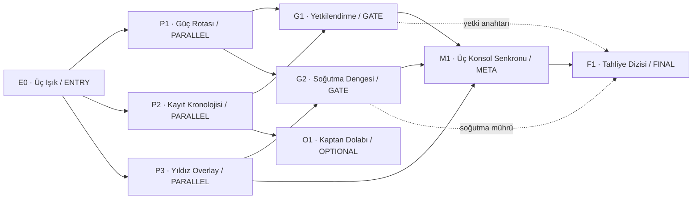

# AI Escape Room — ürün ve sistem tasarımı

Seçilen MVP: **NADİR-3: Son Hava Kilidi**

Oyuncu sayısı: tam olarak 3 insan

Hedef süre: 20–60 dakika

Durum: uygulamaya hazır tasarım; production kodu veya migration uygulanmadı

## 1. Altı dijital escape-room formatı

### 1. Ortak kontrol odası + üç özel konsol — seçilen MVP

Üç oyuncu aynı fiziksel/dijital kontrol odasını görür; Mühendis, Analist ve Navigatör konsolları farklı parçalar gösterir. Ortak objeler, paylaşılan envanter, üç paralel bulmaca ve final senkronizasyonu bulunur.

- **Neden uygun:** Tek harita/UI ile özel bilgi, paralel çalışma, gözlemci–uygulayıcı etkileşimi ve eşzamanlı giriş gösterilebilir.
- **Risk:** Bir oyuncunun herkese ne yapacağını söylemesi. Gönderim sahipliği, özel ekranlar, role dönen ana etkileşimler ve gerçek üçlü eşzamanlı node bunu sınırlar.
- **Solo geliştirici maliyeti:** En düşük; bir oda, 8 zorunlu + 1 opsiyonel node.

### 2. Üç bağlı oda

Her oyuncu ayrı odadadır; kapılar ve cihazlar birbirini etkiler. Oyuncular yalnız ses/metin üzerinden bilgi paylaşır.

- **Güçlü yanı:** İletişim bozukluğu ve uzaktan koordinasyon doğal mekaniktir.
- **Risk:** Üç kat obje/sahne/UI içeriği ve bağlantı kopmasında sert deadlock.
- **Maliyet:** Yüksek; ikinci oda paketi olarak uygun.

### 3. Hasarlı uzay gemisi

Motor, yaşam desteği ve navigasyon alt sistemleri paralel çözülür; kaynak/item durumu ortak metaya bağlanır.

- **Güçlü yanı:** Roller ve sayaç temaya oturur.
- **Risk:** Kaynak tüketimi kritik yolu yanlışlıkla kilitleyebilir.
- **Maliyet:** Orta. Seçilen MVP bu temayı tek kontrol odasına indirger.

### 4. Lanetli arşiv

Belgeler, kronoloji, kelime dönüşümü, sembol dizileri ve sahte kayıtlar üzerinde çalışılır.

- **Güçlü yanı:** Metin ağırlıklı olduğundan erişilebilir ve içerik üretimi ucuzdur.
- **Risk:** Dil/çeviri belirsizliği ve LLM'nin istemeden yeni ipucu eklemesi.
- **Maliyet:** Orta-düşük; güçlü ikinci tema.

### 5. Zaman döngüsü laboratuvarı

Oda belirli sürede sıfırlanır; yalnız işaretlenmiş gözlemler ve bazı item durumları kalır. Çözüm, farklı döngülerde edinilen bilgiyi birleştirir.

- **Güçlü yanı:** Başarısızlık ilerlemeye dönüşür, yüksek tekrar hissi verir.
- **Risk:** State reset/kalıcılık matrisi ve save/reconnect çok daha karmaşıktır.
- **Maliyet:** Yüksek; çekirdek motor kanıtlandıktan sonra.

### 6. Sessiz soygun / iletişim kesintisi

Bir oyuncu kamera, biri kasayı, biri güvenlik sistemini görür. Bazı fazlarda yalnız ikon/ping iletişimi kullanılabilir.

- **Güçlü yanı:** Güven, kısıtlı iletişim ve eşzamanlı hareket.
- **Risk:** Zorunlu iletişim kısıtı erişilebilirliği ve arkadaş grubu rahatlığını bozabilir; gizli PvP hissi yaratabilir.
- **Maliyet:** Orta-yüksek.

**MVP seçimi:** Ortak kontrol odası + üç özel konsol. Uzay gemisi temasının dramatik gücünü korur, fakat üç oda kadar asset/state üretmez. Bir geliştirici aynı engine ile template, hint, item ve private-view sınırlarını kanıtlayabilir.

## 2. NADİR-3 deneyimi

NADİR-3 araştırma istasyonu karantinaya girmiştir. Üç oyuncu tahliye kontrol odasındadır:

- **Mühendis:** güç hatları ve cihaz durumlarını daha ayrıntılı görür;
- **Analist:** kayıtlar, zaman damgaları ve belge ilişkilerini görür;
- **Navigatör:** koordinatlar, harita katmanları ve yön vektörlerini görür.

Roller açık bilgidir; özel ekran içerikleri değildir. Her rolün bir defalık hızlandırıcı yeteneği vardır: Mühendis bir cihaz durumunu, Analist iki kayıt arasındaki kanonik ilişkiyi, Navigatör bir overlay koordinatını açığa çıkarabilir. Bu yetenekler hiçbir zorunlu çözümün tek yolu değildir.

Timer modları:

- `RELAXED`: sayaç yok;
- `STANDARD_45`: 45 dakika;
- `CHALLENGE_30`: 30 dakika.

Sayaç sıfıra gelince oyun bitmez. Session `OVERTIME` olur, derece tavanı C'ye düşer ve oyun aynı deterministic state ile devam eder. Böylece zaman baskısı anlamlıdır fakat bir saatlik oturum sonuçsuz kalmaz.

Derece motor tarafından hesaplanır. Final Assist veya emergency takeover kullanıldıysa `ASSISTED`; overtime ise `C`; süre içinde Tier 3 kullanıldıysa `B`; süre içinde Final Assist olmadan tamamlandıysa en az `A`; ayarlanmış sürenin ilk %75'inde, Tier 2/3 olmadan ve bütün opsiyonel node'larla bitirilirse `S`. Hint ceza saniyeleri yalnız derece için kullanılan ayarlanmış süreye eklenir, canlı sayaçtan zaman çalmaz. `RELAXED` modunun tavanı `A`dır.

## 3. Bulmaca bağımlılık grafiği



### Node sözleşmesi

| Node | Tür | Bağımlılık | Çıktı/işlev |
|---|---|---|---|
| E0 | Entry | yok | Üç özel ışık ipucunu birleştirir; üç paralel konsolu açar |
| P1 | Parallel | E0 | Benzersiz güvenli güç yolu; `charged_fuse` |
| P2 | Parallel | E0 | Dört kaydı sıraya koyar; `archive_strip_47` |
| P3 | Parallel | E0 | Üç koordinat katmanının kesişimi; `nav_vector` |
| G1 | Gate | P1 AND P2 | Eşya+kod yetkilendirmesi; `authorization_key` |
| G2 | Gate | P1 AND P3 | Valf sıralaması; `coolant_seal` |
| O1 | Optional | P2 | Kaptan dolabı, bonus doküman ve derece bonusu; kritik yol çıktısı yok |
| M1 | Meta | G1 AND G2 AND P3 | Üç oyuncunun 10 saniyelik özel girişi; `flight_key` |
| F1 | Final | M1 + G1/G2 item state | Üç item'i çekirdeğe birleştirir ve final işlem sırasını doğrular |

[`state-contract.ts`](./state-contract.ts), graph/node/dependency ve istenen bütün session/player/room/object/item/puzzle/attempt/hint/private clue/inventory/progress tiplerini içerir.

### Deadlock önleme

Session başlamadan graph linter şu koşulları kanıtlar:

1. Zorunlu node grafiği DAG'dir ve topolojik sıra tüm required node'ları içerir.
2. Her required node entry'den erişilebilir; final node bütün zorunlu üreticilerden sonra gelir.
3. Her dependency node vardır ve hiçbir required node yalnız optional node çıktısına bağlı değildir.
4. Item-flow analizi her kritik item için tek üretici, geçerli tüketici ve yeterli miktar bulur. Aynı tek-kullanımlık item iki zorunlu dalda tüketilemez.
5. Yanlış cevap ve zaman aşımı item tüketmez, object'i kalıcı kapatmaz, FSM'yi geri dönüşsüz non-accepting state'e sokmaz.
6. Simultaneous pencere başarısız olursa bütün geçici girişler temizlenir; sınırsız retry vardır.
7. Özel ipucu gerektiren her node `AFTER_DISCONNECT_GRACE` takeover veya eşdeğer template fallback'e sahiptir.
8. Her çözüm instance'ı oracle/solver ile tekil doğrulanır; başarısız seed atılır ve deterministik sıradaki seed denenir. Üç denemeden sonra bilinen güvenli fixture kullanılır.

Her state commit'inden sonra çalışma zamanı invariant'ı kontrol edilir: session tamamlanmadıysa en az bir required node `AVAILABLE/IN_PROGRESS` olmalıdır. İhlal transaction'ı rollback eder ve otomatik unlock üretmez.

## 4. Bulmaca taksonomisi

[`puzzle-taxonomy.md`](./puzzle-taxonomy.md) 17 tür için şunları ayrı ayrı tanımlar:

- input ve çözüm temsili;
- deterministic validator;
- zorluk ayarları;
- üç oyunculu işbirliği biçimi;
- erişilebilirlik alternatifi;
- LLM'nin izinli rolü;
- belirsizlik riski ve azaltımı.

Kapsam: exact code, normalize metin, sıralama, küme, sayısal tolerans, item combination, state routing, multi-step/FSM, logic grid, observation, belge kronolojisi, kelime dönüşümü, harita overlay, network path, simultaneous input, audio pattern ve cross-reference deduction.

## 5. Kesin cevap doğrulama

[`validation-contract.ts`](./validation-contract.ts) sekiz ayrık cevap türünü tanımlar:

| Tür | Kural |
|---|---|
| `EXACT_CODE` | Sabit alphabet/uzunluk; constant-time tam eşitlik; baştaki sıfırlar anlamlı |
| `NORMALIZED_TEXT` | Sürüme bağlı Unicode NFKC + locale casefold + whitespace + allowlist punctuation; beklenen/alias HMAC eşitliği |
| `ORDERED_SEQUENCE` | Aynı uzunluk ve sırayla element hash eşitliği |
| `SET_EQUALITY` | Normalize benzersiz elemanlar, eşit kardinalite ve küme eşitliği |
| `NUMERIC_TOLERANCE` | Birim dönüşümü; `abs(error) <= max(absTol, relTol*abs(expected))` |
| `ITEM_COMBINATION` | Erişilebilir item instance multiset/state recipe'si, transaction içinde |
| `STATE_CONDITION` | Authoritative state üzerinde allowlist predicate AST |
| `MULTI_STEP` | Sürümlü finite-state machine'de geçerli transition ve accepting state |

LLM serbest metni bir veya iki typed submission adayına çevirebilir; `requiresPlayerConfirmation=true` zorunludur. Doğruluk veya “yakınlık” söyleyemez. Embedding, edit distance, fuzzy matching ve sonradan eklenmiş synonym yoktur.

Yanlış deneme varsayılan olarak yalnız `INCORRECT` döndürür. “2 rakam doğru yerde” gibi bilgi ancak template `TEMPLATE_BOUNDED` feedback tanımlıyorsa verilir. Aynı answer hash'i/revizyondaki tekrar `DUPLICATE` olur; yeni attempt/hint sayacı veya state revision üretmez. Oyuncu+bulmaca başına 30 saniyede varsayılan 5 farklı deneme sınırı vardır.

## 6. Güvenli template ve prosedürel üretim

Tam şema [`puzzle-template.schema.json`](./puzzle-template.schema.json) içindedir. Template arbitrary code/expression kabul etmez; `solutionRule` kapalı enum'dur.

Örnek template instance tanımı:

```json
{
  "templateId": "symbol_sequence_v1",
  "templateVersion": "1.0.0",
  "category": "ORDERING",
  "answerType": "ORDERED_SEQUENCE",
  "solutionRule": "ORDER_BY_TIMESTAMP",
  "difficulty": 2,
  "variableDefinitions": [
    {"key": "symbols", "valueType": "STRING_ARRAY", "source": "CURATED_POOL", "visibility": "PUBLIC", "minItems": 3, "maxItems": 5, "curatedPoolKey": "ACCESSIBLE_SYMBOLS"},
    {"key": "timestamps", "valueType": "INTEGER_ARRAY", "source": "SEEDED_GENERATOR", "visibility": "ENGINE_ONLY", "minItems": 3, "maxItems": 5}
  ],
  "generationConstraints": {
    "uniqueSolution": true,
    "maximumSearchSpace": 120,
    "minimumInformationSources": 2,
    "maximumAttemptsExpected": 4,
    "forbidAccidentalAlternateSolutions": true,
    "requiredObjectStateTags": []
  }
}
```

Üretim hattı:

1. Elle yazılmış, sürümlü graph ve puzzle template seti seçilir.
2. Server committed RNG ile yalnız şemadaki variable'ları üretir.
3. `solutionRule` saf oracle çözümü hesaplar ve şifreler; çözüm LLM'ye verilmez.
4. Solver tek çözüm, beklenen arama alanı, alias, item-flow, accessibility ve dependency koşullarını test eder.
5. Kanonik public/private artefact'lar ve dört hint tier'ı çözüm provenance'ından türetilir.
6. LLM yalnız `renderSlots` içindeki title/room wrapper/document wrapper/item label/NPC line alanlarını doldurur. Her çağrı tek audience ve allowlist variable seti görür.
7. Çıktı schema, uzunluk, izinli variable echo, ekstra sayı/simge/zaman ilişkisi, spoiler ve secret taramasından geçer; aksi halde deterministic metin kullanılır.
8. Template/variable/solution/graph hash'leri session boyunca değişmez.

Güvenli prosedürel alan: sayı/simge seçimi, sıralama, koordinat, belge/etiket kaplaması, distractor seçimi ve tema dili. Güvensiz alan: LLM'nin çözüm kuralı, dependency, item recipe, doğru cevap alias'ı, hint bilgi içeriği veya graph üretmesi.

Tam AI üretimi çoklu/çelişkili çözüm, fark edilmemiş kültürel varsayım, çözümü metinde istemeden verme, erişilebilirlik alternatifiyle eşdeğer olmayan bilgi, item deadlock ve doğrulanamayan hint artışı yaratır. Bu nedenle production'da kullanılmaz.

## 7. Kademeli ve uyarlanabilir hint sistemi

Hint metni üretken olabilir, hint **bilgisi** olamaz. Her template dört kanonik packet içerir:

| Tier | İçerik | Varsayılan açılma/teklif koşulu | Sonuç etkisi |
|---|---|---|---|
| 1 — Direction | İlgili obje/bilgi ailesine yöneltir | hemen istenebilir; 180 sn, 1 hata veya 120 sn inactivity'de teklif | ceza yok |
| 2 — Stronger clue | Kullanılacak ilişki/işlemi adlandırır | Tier1 + 120 sn veya toplam 3 hata | derece süresine +60 sn |
| 3 — Near-solution | Son dönüşümü söyler, bir mekanik adımı bırakır | Tier2 + 180 sn veya toplam 5 hata | derece süresine +180 sn |
| 4 — Final assist | Yalnız mevcut node'u `ASSISTED_SOLVE` ile çözer | Tier3 + 240 sn; üç oyuncunun açık onayı | derece `ASSISTED`, unlock normal effect'lerle |

Otomatik sistem hint'i **teklif eder**, kendiliğinden göstermez. Adaptasyon sinyalleri:

- node üzerinde geçen server süresi;
- benzersiz başarısız attempt sayısı;
- oyuncu/role activity timestamp'i;
- oyuncuların açıkça seçtiği `assumptionTag` gözlemleri;
- dependency node'ların public solved/progress durumu;
- daha önce teslim edilen hint tier'ı.

Sistem sesli sohbeti veya serbest tartışmayı gizlice analiz edip “yanlış varsayım” çıkarmaz. Yalnız açık yapılandırılmış gözlem etiketi ve validator sonucu kullanılır.

Private puzzle hint'i yalnız ilgili oyuncuya gider. Public hint, başka oyuncunun private clue metnini almaz; gerekirse “diğer konsollardan bir karşılaştırma isteyin” der. Bir dependency çözülmediyse hint onun sonucunu söylemez. Final assist mevcut node dışındaki graph/solution/item grant bilgisini açıklamaz.

## 8. Üç oyunculu işbirliği

- Her required bulmaca en az iki bilgi kaynağı kullanır; meta puzzle üç ayrı girişi zorunlu kılar.
- Üç parallel node'un birincil etkileşim sahibi farklıdır; gate sahipliği de en az mekanik gönderim yapan oyuncuya döner.
- Özel ekranlar aynı çözümün kopyası değildir: topoloji/risk/hedef, belge parçaları veya harita katmanları ayrıdır.
- Bazı sahnelerde biri cihazı değiştirirken diğeri private metreyi gözler, üçüncüsü güvenlik kuralını takip eder. Motor her rol için `OBSERVE`, `ACT`, `VERIFY` katkısını kaydeder.
- Simultaneous node'da bir oyuncu başkası adına giriş gönderemez; token oyuncu kimliğine bağlıdır.
- Shared observation board gerçekleri otomatik doğru saymaz. Notlar iletişim içindir; yanlış not puzzle state'i değiştirmez.
- Erişilebilirlik modunda 10 saniyelik simultaneous input yerine commit/reveal kullanılır: üç oyuncu 60 saniye içinde değerini mühürler, sonra birlikte çözülür. Bilgi ve doğrulama aynıdır.
- Bir oyuncu 120 saniyeden uzun koparsa motor o node'un game-only private clue'sunu `EMERGENCY_TAKEOVER` olarak kalanlara açabilir; çözüm assisted olarak işaretlenir. Kişisel veri/Party Lore değildir ve reconnect eden oyuncuya olay gösterilir.

Hiçbir required node tek bir role ability charge'a bağlı değildir. Ability yalnız hızı artırır. Başarısız giriş başka oyuncuyu oyundan çıkarmaz veya özel ekranını kapatmaz.

## 9. AI host ve araç sınırı

Production host promptu [`host-prompt.md`](./host-prompt.md) içindedir. Ana kurallar:

- `VALIDATOR_RESULT` dışında doğruluk beyanı yok;
- yanlış cevabı yaklaşık/makul diye kabul etmez;
- yalnız authorize edilmiş hint tier/packet'i anlatır;
- başka puzzle/private clue/metadata spoiler'ı yok;
- normal cevap ≤60, hint ≤80 kelime;
- state değişimi veya oyuncu adına tool mutation yok;
- LLM yokken localized deterministic host/hint/recap ile oyun tam devam eder.

[`tool-contract.ts`](./tool-contract.ts) istenen bütün araçları ve JSON Schema'larını tanımlar:

- `get_public_room_state`, `get_private_player_view`;
- `inspect_object`, `use_item`, `combine_items`, `submit_answer`;
- `request_hint`, `unlock_object`, `advance_puzzle`;
- `check_completion`, `record_observation`.

Şema olarak geçerli çağrı yetki değildir. Her mutasyon capability'si session, player, operation, tam argüman hash'i, revision ve kısa süreyi bağlar; transaction içinde bir kez tüketilir. `unlock_object` ve `advance_puzzle` yalnız engine resolver'a açıktır. Host modelinin mutation tool'u yoktur.

## 10. Party Lore

İzinli kullanım:

- puzzle/oda adı;
- çözüm taşımayan sahte belgenin dekoratif cümleleri;
- item etiketi;
- oda atmosferi;
- completion recap şakası.

Yasak kullanım:

- doğru cevap, alias, sıralama ilişkisi, koordinat, item recipe, graph dependency veya hint bilgisi;
- unutulan eski şakanın çözüm için gerekmesi;
- bir oyuncunun private clue'sunu başka bir oyuncunun lore referansıyla ima etmek;
- hassas/mahrem gerçekleri fake document içine taşımak.

Yalnız açık rızalı, düşük hassasiyetli `ESCAPE_ROOM_FLAVOR` referansları kullanılır; room başına en fazla 2. Lore slotu çıkarıldığında puzzle instance hash'inin mekanik bölümü, çözüm ve validator aynı kalır. Her lore metni kurmaca isim/bağlam dönüşümünden geçer ve kaynak oyuncu belirtilmez.

## 11. Multiplayer mimarisi

### Oda ve başlangıç

1. Aynı Nexus sunucusunun bir üyesi session oluşturur; API yalnız hash'i saklanan 8 karakterli, 30 dakika geçerli kod döndürür.
2. Join transaction room row'u kilitler; tam üç farklı kullanıcı ve `{0,1,2}` koltukları aşılmaz.
3. Roller koltuklara deterministik döner ve açıktır; private delivery testi tamamlanmadan ready olunamaz.
4. Start transaction üç oyuncu, üç rol, erişilebilirlik/timer ayarı, linted graph ve doğrulanmış puzzle instance'larını yeniden kontrol eder.

### Shared/private state ve gerçek zaman

- Komutlar REST + `Idempotency-Key` + `expectedRevision`; WebSocket yalnız audience-filtered event taşır.
- 60 saniyelik tek kullanımlık WS ticket uzun ömürlü JWT'nin URL'ye konmasını önler.
- Public projector graph dependency, solution spec, hint canonical code, private clue/object/item ve answer hash döndürmez.
- Private projector yalnız authenticated self'e ek alan verir; üç oyuncu private context'i batch edilmez.
- Reconnect `lastSeenSequence/revision` ile 500 olaya kadar replay, daha büyük boşlukta public + self-private snapshot alır.
- Host lobby'de timer/difficulty/accessibility/invite/start; oyun sırasında yalnız pause/resume yetkisine sahiptir. Çözüm, private clue, unlock, item, sayaç değeri veya node ilerlemesini değiştiremez.
- Host lobby'de ayrılırsa en eski oyuncuya geçer. Başladıktan sonra backend otoritedir; host disconnect çözümü etkilemez.

### Timer ve resume

Timer istemci interval'ına güvenmez. DB'deki `started_at`, pause toplamı ve server saatiyle hesaplanır. Pause transaction snapshot yazar; resume son committed revision/RNG counter/item reservation durumundan devam eder. Process restart'ta açık simultaneous window iptal edilir ve cezasız tekrar açılır.

API ve event union'ı [`realtime-contract.ts`](./realtime-contract.ts) içinde tanımlıdır.

## 12. PostgreSQL modeli

[`schema.sql`](./schema.sql), çakışmayı önlemek için `escape_room` PostgreSQL şemasında istenen tabloları içerir:

- `escape_sessions`, `escape_players`, `room_states`;
- `puzzle_instances`, `puzzle_attempts`, `hint_requests`;
- `item_instances`, `inventories`, `private_clues`;
- `generated_flavor`, `session_results`.

Graph, objeler, replay ve eşzamanlılık için ayrıca `puzzle_graphs`, `room_objects`, `simultaneous_inputs`, `observations`, `session_events` vardır.

Çözüm spec'leri, full graph, private değişken/ipucu/attempt/input ve engine state uygulama katmanında AES-256-GCM ile şifrelidir. Commitment'lar küçük cevap uzayında brute force edilmemesi için gizli rastgele 256-bit salt içerir. AI flavor mevcut PostgreSQL lease/retry worker kalıbıyla state transaction dışında çalışır.

## 13. Solo geliştirici yol haritası

### Faz 0 — tek sabit oda

- NADİR-3'ün E0, üç parallel, iki gate, meta, final ve bir optional node'unu sabit variable'larla CLI/tek web sayfasında kur.
- AI yok; bütün metin ve hint deterministic.

### Faz 1 — deterministic puzzle engine

- Sekiz validator, graph evaluator/linter, item-flow, attempt/idempotency, timer ve session result.
- Golden walkthrough ve solver uniqueness testleri deployment gate.

### Faz 2 — üç oyunculu görünümler

- Lobby, public/private projector, roller, private clues, shared inventory/notes, simultaneous input, reconnect.
- Bir tarayıcı üç test profiliyle E2E oynayabilmeli.

### Faz 3 — Hint AI

- Canonical four-tier packets, authorization state machine, host prompt, structured output ve deterministic fallback.
- Model outage puzzle akışına sıfır etkili.

### Faz 4 — Template sistemi

- JSON Schema loader, curated pools, seeded variable generation, solution oracle ve safe render slots.

### Faz 5 — Prosedürel varyantlar

- Aynı graph'ta kod/sembol/koordinat/log değişkenleri; instance hash ve 10 bin seed doğrulaması.

### Faz 6 — Party Lore

- Opt-in cosmetic retrieval, kurmaca dönüşüm, slot budget ve cache invalidation.

### Faz 7 — Ek odalar

- Lanetli Arşiv paketi; sonra üç bağlı oda veya zaman döngüsü. Her paket ayrı graph/content sürümü.

## 14. İlk 10 uygulama görevi

1. `nadir-three-v1` graph manifestini ve 9 node'un sabit fixture'ını yaz.
2. `EXACT_CODE`, `NORMALIZED_TEXT`, `ORDERED_SEQUENCE`, `SET_EQUALITY` validatorlarını ekle.
3. Numeric, item multiset, predicate AST ve FSM validatorlarını tamamla.
4. Graph reachability/topological/dependency/item-flow/optional isolation linter'ını yaz.
5. Saf session reducer, capability, idempotent attempt ve committed RNG altyapısını kur.
6. Üç özel terminal görünümüyle tam CLI walkthrough ve deterministic replay fixture oluştur.
7. Template JSON Schema loader, seeded variable generator ve oracle uniqueness harness'ı ekle.
8. PostgreSQL modelleri/Alembic migration, encrypted solution/private repository ve action transaction'larını yaz.
9. Lobby, public/private REST projector, WebSocket replay/reconnect ve minimal React room UI'ını yap.
10. Hint tier state machine + AI host/fallback worker'ını ekleyip spoiler/leakage testlerini CI gate yap.

## 15. Test stratejisi

### Doğrulama ve normalizasyon

- Her answer type için doğru, yanlış, sınır, boş, fazla uzun, yanlış tip/birim ve mixed-script confusable fixture'ları.
- Türkçe I/İ/ı/i, NFKC, birleşik aksan, whitespace, punctuation allowlist ve finite alias golden testleri.
- Exact code `0472` ile `472` eşit değildir; ordered sequence permutation'ları reddedilir; set duplicate'ları invalid format olur.
- Numeric absolute/relative tolerans sınırının iki tarafı; item quantity/state/reservation yarışları; FSM invalid/reset/accepting geçişleri.
- LLM “bence doğru” çıktısı validator yolunda hiç okunmaz.

### Graph ve deadlock

- Eksik node, cycle, unreachable final, required→optional dependency, item before-producer, double-consume ve no-takeover private gate fixture'ları linter tarafından reddedilir.
- Her valid template seed'i için solver tam bir çözüm ve benzersizlik kanıtı üretir.
- Her legal state transition sonrası en az bir required available node veya completion invariant'ı.
- Yanlış answer/hint/timer/simultaneous timeout hiçbir kritik item'i tüketmez.

### Hint ve spoiler

- Her tier çıktısı allowlist variable/fact tokenları dışında sayı, sembol, object/node adı içeremez.
- Tier1/2 solution'ı tek başına belirleyemez; Tier3 tam cevabı bırakmaz; Final Assist yalnız current puzzle'a erişir.
- Private hint A'nın public/B/C payload, job cache, trace ve event'inde bulunmaz.
- Related puzzle çözülmemişse hint onun sonuç/item grant'ını anmaz.
- Model bozuk JSON, injection, direkt çözüm isteği ve unauthorized tier'da deterministic fallback/denial.

### Multiplayer, timer ve kurtarma

- İki üçüncü join yarışında biri commit; duplicate submit tek attempt/RNG/revision.
- Eski socket'in kapanışı yeni reconnect'i offline yapmaz; 500 altı replay ve büyük-gap snapshot audience-safe.
- Üç simultaneous input pencere içi/dışı, duplicate, disconnect ve process restart testleri.
- Pause/resume ile elapsed/remaining hesabı; tam deadline, clock skew ve overtime tek geçiş.
- Host değişimi çözüm/private yetki kazandırmaz; host answer/unlock/advance çağrısı reddedilir.

### Denge ve erişilebilirlik

- 10 bin generated instance'ta çözüm tekilliği, beklenen attempt, hint kullanımı ve süre dağılımı.
- Oyuncu/rol başına primary submission, observe/act/verify katkısı ve inactivity süreleri.
- Renk/audio/görsel/motor alternatifi aynı kanonik fact ID'lerini verir; erişilebilirlik modu çözümü veya dereceyi cezalandırmaz.

## 16. Tam örnek oda

Session: Standart 45 dakika. Oyuncular: Ece=Mühendis, Bora=Analist, Cem=Navigatör. Seed commitment oyun başında yayınlanır.

### E0 — Üç Işık

Ortak panelde `KEHRİBAR`, `CAMGÖBEĞİ`, `MOR` düğmeleri vardır.

- Ece: “Kehribar, camgöbeğinden önce.”
- Bora: “Mor son sırada.”
- Cem: “Camgöbeği, morun hemen önünde.”

Ece panelde `[KEHRİBAR, CAMGÖBEĞİ, MOR]` sırasını gönderir. `ORDERED_SEQUENCE` validator doğru bulur; üç konsol açılır.

### P1 — Güç Rotası

Ece topolojiyi görür: `A-B`, `A-C`, `B-D`, `C-E`, `D-F`, `E-F`. Bora'nın metresi `B-D` hattının aşırı yüklü olduğunu, Cem'in hedef ekranı güvenli yolun `E` üzerinden `F`'de bitmesi gerektiğini gösterir. Çözüm `[A,C,E,F]`; `charged_fuse` shared inventory'ye eklenir.

### P2 — Kayıt Kronolojisi

İlişkiler oyunculara bölünür: Kestrel Vale'den önce; Vale Morrow'un hemen önünde; Orbit Morrow'dan sonra. Bora `[KESTREL, VALE, MORROW, ORBIT]` gönderir. Çözüm doğru; `archive_strip_47` oluşur.

### P3 — Yıldız Overlay

- güç katmanı: `{B2,D4,F1,C3}`;
- temiz sektör katmanı: `{B2,D4,F1,A1}`;
- tahliye hizası: `{B2,D4,F1,E5}`.

Cem üç ekranın kesişimini `SET_EQUALITY {B2,D4,F1}` olarak gönderir. `nav_vector` elde edilir.

### G1 — Yetkilendirme

Ece `charged_fuse`u panelde kullanır; sigorta `2` rakamını gösterir. Arşiv şeridi `47`, ortak plaka “kayıt çifti enerji rakamından önce gelir” der. Bora exact code `472` girer. `authorization_key` açılır. `0472` veya “dört yüz yetmiş iki” kabul edilmez.

### G2 — Soğutma Dengesi

Ortak talimat “valfleri tahliye koordinatlarının sayısal sonlarına göre sırala” der. `B2,D4,F1` → `[2,4,1]`. Cem ordered numeric sequence'i gönderir; `coolant_seal` kazanılır.

### O1 — Kaptan Dolabı (opsiyonel)

Bora kronoloji belgelerindeki işaretli ilk harfleri deterministic word-transform ile `NADİR`e çevirir. Normalize text validator kabul eder; bonus doküman ve stabilizer patch açılır. Hiçbir required node buna bağlı değildir.

### M1 — Üç Konsol Senkronu

G1/G2/P3 tamamlanınca üç özel ekran açılır: Ece `3`, Bora `7`, Cem `5` görür. 10 saniyelik pencere açılır; herkes yalnız kendi tokenıyla değerini girer. Üç giriş `[3,7,5]` oracle'ıyla eşleşir ve `flight_key` üretilir. İlk deneme zaman aşımına uğrasaydı bütün geçici değerler silinecek, hiçbir item/state kaybolmayacaktı.

### F1 — Tahliye Dizisi

Ece, `authorization_key + coolant_seal + flight_key` item multiset'ini birleştirir; transaction üç item'i rezerve edip `evacuation_core` üretir. Ortak güvenlik kartlarındaki kısıtlar:

- basınç yetkilendirmeden önce;
- hizalama yetkilendirmeden sonra;
- fırlatma son.

Oyuncular `[PRESSURIZE, AUTHORIZE, ALIGN, LAUNCH]` dizisini gönderir. Final node `SOLVED`, timer 31:42'de durur, session `COMPLETED/ESCAPED` olur. Hint/final assist kullanılmadığı ve O1 çözüldüğü için derece `S`tir. Engine tohum reveal ve mekanik recap'i hemen yayınlar; AI yalnız üç oyuncunun katkılarını kısa tematik bir finalle anlatır.

## 17. Paket teslimleri

- Bu belge: altı format, seçilen MVP, tam graph, generation/hint/cooperation/multiplayer mimarisi, roadmap, testler, ilk 10 görev ve eksiksiz oda.
- [`state-contract.ts`](./state-contract.ts): bütün istenen domain/state/graph/view tipleri.
- [`validation-contract.ts`](./validation-contract.ts): sekiz strict validator ve intent interpretation sözleşmesi.
- [`puzzle-template.schema.json`](./puzzle-template.schema.json): procedural generation ve validation JSON Schema'sı.
- [`puzzle-taxonomy.md`](./puzzle-taxonomy.md): 17 puzzle türü.
- [`tool-contract.ts`](./tool-contract.ts): istenen araçlar, izinler ve JSON Schema'ları.
- [`host-prompt.md`](./host-prompt.md): production AI host promptu.
- [`schema.sql`](./schema.sql): PostgreSQL tabloları, encryption ve transaction sınırları.
- [`realtime-contract.ts`](./realtime-contract.ts): API, WebSocket, timer, reconnect ve host sözleşmeleri.

İlk güvenli adım sabit NADİR-3 fixture'ını AI olmadan CLI'da uçtan uca çözmektir. Template/procedural/LLM katmanı, validator ve graph deadlock testleri tamamlanmadan açılmamalıdır.
