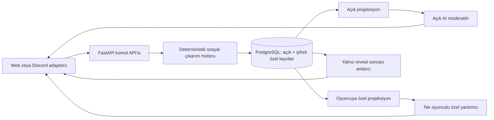

# Gizli Rol Oyunu — Üç Mühür Protokolü

Durum: uygulamaya hazır ürün ve sistem tasarımı; production kodu veya migration uygulanmadı

Oyuncu sayısı: tam olarak 3 insan

Hedef süre: 10–30 dakika, en fazla 4 kriz

## 1. Üç oyuncuya özel altı konsept

### 1. Üç Mühür Protokolü — seçilen konsept

- **Roller:** Her oyuncu birbirinden bağımsız iki gizli kart alır. Makamlar `Muhafız`, `Arşivci`, `Elçi`; Talimatlar `Mühürle`, `Açığa Çıkar`, `Yönlendir`. Her kümedeki üç değer oyunda tam birer kez bulunur.
- **Bilgi asimetrisi:** Makam, oyuncunun kriz hakkında gördüğü bilgi merceğini belirler: güvenlik riski, kaynağın gerçekliği veya dış sonuçlar. Talimat, oyuncuya tercih ettiği toplu sonuç için gizli puan verir.
- **Ana döngü:** Özel ipucunu oku → yapılandırılmış bir iddia oluştur → bir iddiayı özel olarak incele → tartış → gizli oy kullan → gerçek güvenli seçenek ve oylar açıklansın.
- **Kazanma:** Dört kriz boyunca doğru iddia, güvenli bireysel oy, gizli Talimat, özel hedef ve oyun sonu rol eşleştirmesinden en yüksek puanı topla.
- **Blöf:** Oyuncu doğru ipucunu aktarabilir, başka bir Makamı taklit edebilir veya Talimatını gizlemek için tercihinin tersine oy verebilir.
- **Neden üç kişiyle çalışır:** Sabit iyi/kötü takımı yoktur. Üç Talimat birbirinden farklı olduğundan kalıcı ikili çıkar ittifakı oluşmaz; herhangi iki dürüst bilgi merceği çözümü bulmaya yeterlidir.
- **Risk:** Mantık ipuçları fazla kolay olursa sosyal çıkarım anlamsız, fazla kapalı olursa rastgele olur. İçerik paketi çevrimdışı çözülebilirlik testinden geçmelidir.
- **Geliştirme karmaşıklığı:** Düşük-orta. Sabit üç seçenek, dört tur, şablonlu ipuçları ve eşzamanlı fazlar solo geliştiriciye uygundur.

### 2. Kırık Alibi Borsası

- **Roller:** Tanık, Sigortacı, Muhbir; her biri olayın farklı zaman aralığını görür.
- **Bilgi asimetrisi:** Üç parçalı olay çizelgesinin yalnızca bir bölümü ve saklanması istenen kişisel bir ayrıntı görünür.
- **Ana döngü:** Zaman kartı seç, olay cümlesi yayınla, başka bir cümlede tutarsızlık ara, ortak alibi oylaması yap.
- **Kazanma:** Doğru olay çizelgesi oluşturulurken kişisel saklama hedefini tamamlamak ve doğru tutarsızlıkları yakalamak.
- **Blöf:** Gerçek bir olayı yanlış zamanda anlatmak veya önemsiz bir sırrı büyük sır gibi sunmak.
- **Neden üç kişiyle çalışır:** Her zaman çizelgesi parçasının iki komşusu vardır; iki ifade üçüncüyü çapraz kontrol eder.
- **Risk:** Doğal dil serbest bırakılırsa deterministik doğrulama zorlaşır; fazla yapılandırılırsa sohbet hissi azalır.
- **Geliştirme karmaşıklığı:** Orta-yüksek; zaman mantığı ve çok sayıda tutarlı senaryo gerekir.

### 3. Hayalet Müzayede

- **Roller:** Koleksiyoncu, Mühürcü, Simsâr; her biri eser etkilerinin farklı kısmını bilir.
- **Bilgi asimetrisi:** Değer, lanet ve sahtecilik bilgileri üç oyuncuya bölünür; kişisel koleksiyon hedefleri gizlidir.
- **Ana döngü:** Eseri incele, açık iddia yap, kapalı teklif ver, satın alınan eserin sonucunu çöz.
- **Kazanma:** Lanet eşiğini aşmadan gizli setini ve doğru tahminlerini puanlamak.
- **Blöf:** Bir eserin değerini düşürmek, kendi istemediği eseri istiyormuş gibi göstermek.
- **Neden üç kişiyle çalışır:** Üç yönlü teklif, iki kişilik açık artırmadaki mekanik blöfü önler; herkesin farklı bilgi ekseni vardır.
- **Risk:** Ekonomi kartopu oluşturabilir ve açık artırma dengesi çok simülasyon ister.
- **Geliştirme karmaşıklığı:** Orta; para ekonomisi ve eser destesi gerektirir.

### 4. Yankı İstasyonu

- **Roller:** Frekansçı, Dilbilimci, Güvenlik Subayı.
- **Bilgi asimetrisi:** Aynı uzay sinyalinin frekans, anlam ve tehdit analizleri ayrı oyunculardadır; bir analiz her tur gürültülü olabilir.
- **Ana döngü:** Sinyal parçası al, yorum yayınla, anten kanalını seç, ortak yanıtı oyla.
- **Kazanma:** İstasyonu korurken kendi araştırma hipotezini ve rol tahminlerini tamamlamak.
- **Blöf:** Gürültülü veriyi kesinmiş gibi sunmak veya uzmanlığını gizlemek.
- **Neden üç kişiyle çalışır:** Üç analiz ekseni tek bir ortak karara doğal biçimde bağlanır.
- **Risk:** “Bir veri gürültülü” kuralı oyuncuya haksız hissettirebilir ve açıklaması zordur.
- **Geliştirme karmaşıklığı:** Orta; güçlü tema ama ipucu üretimi hassas.

### 5. Cam Elçilik

- **Roller:** Protokolcü, Casus Avcısı, Ticaret Elçisi; gizli patron hedefleri ayrıca dağıtılır.
- **Bilgi asimetrisi:** Her oyuncu NPC devletlerin farklı tepki tablolarını görür.
- **Ana döngü:** Bir madde öner, NPC tepkisini özel gör, müzakere et, anlaşma maddesine oy ver.
- **Kazanma:** Elçiliği ayakta tutup gizli patronunun iki maddesini geçirmek ve patron eşleştirmelerini çözmek.
- **Blöf:** NPC tepkisini çarpıtmak veya başka patronun istediği maddeyi savunmak.
- **Neden üç kişiyle çalışır:** Üç maddeden iki oy gerekir; benzersiz patronlar kalıcı takım oluşmasını azaltır.
- **Risk:** NPC davranışı LLM’ye bırakılırsa adalet bozulur; tam deterministik tepki matrisi içerik maliyetini artırır.
- **Geliştirme karmaşıklığı:** Orta-yüksek.

### 6. Kayıp Hafıza Rölesi

- **Roller:** Geçmiş, Şimdi ve Gelecek operatörleri; her biri farklı nedensellik kuralını bilir.
- **Bilgi asimetrisi:** Aynı olayın üç zaman kesiti ve kişisel paradoks hedefi ayrı tutulur.
- **Ana döngü:** Hafıza kartı yerleştir, nedensellik iddiası yap, bir kartı sorgula, ortak zaman çizgisini kilitle.
- **Kazanma:** Çizelgeyi çökertmeden gizli paradoks desenini ve rol tahminlerini tamamlamak.
- **Blöf:** Sebep-sonuç yönünü ters anlatmak veya yanlış bir role ait kuralı taklit etmek.
- **Neden üç kişiyle çalışır:** Üç zaman rolü kapalı ve simetrik bir bilgi halkası oluşturur.
- **Risk:** Öğrenme eğrisi ve kombinatoryal senaryo doğrulaması 10–30 dakikalık hedefi aşabilir.
- **Geliştirme karmaşıklığı:** Yüksek.

**Seçim: Üç Mühür Protokolü.** En küçük kurallar yüzeyiyle gerçek blöf ve çıkar çatışması sağlar. Klasik “iki kişi haini bulsun” düzenini kullanmaz; hiç kimsenin doğuştan kötü olmadığı iki katmanlı gizlilik, tekrar maçlarında hem bilgi hem motivasyon eşleşmesini değiştirir. AI kapalıyken bütünüyle oynanabilir.

## 2. Tam kurallar

### Gizli kimlik

Her oyuncunun gizli rolü iki parçadır:

| Makam | Gördüğü bilgi merceği |
|---|---|
| Muhafız (`SENTINEL`) | Tehdit, sızıntı ve muhafaza riski |
| Arşivci (`ARCHIVIST`) | Kaynak, gerçeklik ve kayıt zinciri |
| Elçi (`ENVOY`) | Dış tepki, yayılma ve siyasi sonuç |

| Talimat | Tercih ettiği toplu karar |
|---|---|
| Mühürle (`SEAL`) | Kriz nesnesini kapat veya etkisizleştir |
| Açığa Çıkar (`REVEAL`) | Bilgiyi doğrula ve yayınla |
| Yönlendir (`REDIRECT`) | Nesneyi/etkiyi başka bir hedefe gönder |

Makamlar ve Talimatlar birbirlerinden bağımsız olarak karıştırılır. Her birinden tam bir tane dağıtılır. Oyuncu kendi ikilisini, özel hedefini ve kendi ipucunu görür; diğerlerinin hiçbir özel alanını göremez.

### Kurulum

1. Tam üç aynı sunucu üyesi odaya katılır ve özel mesaj kanalını doğrular.
2. Motor kurallar/içerik sürümünü, dört kriz senaryosunu ve doğrulanabilir RNG tohum taahhüdünü sabitler.
3. Makamlar ve Talimatlar iki ayrı deterministik karıştırmayla bijektif dağıtılır; atama taahhütleri oyun başlamadan kaydedilir.
4. Her oyuncuya hedef belirtmeyen bir özel hedef verilir.
5. İtibar 3, açık İçgörü 0, gizli Talimat puanı 0; ortak İstikrar 4/5 başlar.
6. İlk tur Hakemi committed RNG ile seçilir, sonra her tur koltuk sırasıyla döner. Hakem yalnızca üçlü oy eşitliğini çözer; ekstra bilgi veya oy ağırlığı almaz.

### Tur yapısı

Oyun dört krizden oluşur; İstikrar 0 olursa kriz çözümünden sonra erken biter. Her kriz eşzamanlı fazlarla ilerler:

1. **İpucu (20 sn):** Ortak kriz metni, üç seçenek ve ortak dayanak açıklanır. Her oyuncuya Makam merceğine ait tek özel kanonik ipucu teslim edilir.
2. **İddia (45 sn):** Her oyuncu bir yapılandırılmış delil iddiası yayınlar veya pas geçer. Serbest metin yalnızca üsluptur.
3. **Tartışma/inceleme (ayar: 60/90/120 sn):** Oyuncu bir açık iddiayı özel olarak inceleyip bunun kendi ipucuyla `uyumlu`, `çatışan` veya `ilgisiz` olduğunu öğrenebilir. İsterse açık bir Makam/Talimat suçlaması yapabilir.
4. **Oy (30 sn):** Her oyuncu A/B/C seçeneklerinden birine gizli oy verir. Oy yalnız kendisine makbuz olarak döner.
5. **Çözüm:** İki veya üç oy alan seçenek seçilir. Oylar 1–1–1 ise önceden görünen Hakemin oyu seçimi belirler. Oylar, güvenli seçenek, iddia hükümleri ve açık puan değişimleri birlikte açıklanır.

Eksik oy için 60 saniyelik bağlantı toleransı uygulanır. Süre sonunda motor yalnız ortak dayanak ipucuna göre önceden hesaplanmış güvenli adaylardan birine `AUTO` oy verir. Otomatik oy güvenli-oy İçgörüsü kazandırmaz; sonuç ve kimden geldiği açıklanır. Yenileme veya tekrar istek oy değiştirmez.

### Açık ve özel bilgi

**Her zaman açık:** oyuncular, koltuklar, İtibar, açık İçgörü, İstikrar, faz/süre, kriz/seçenekler, ortak ipucu, yapılandırılmış iddialar, gönderilen oy sayısı ve önceki tur sonuçları.

**Tur çözülünce açık:** her oyuncunun oyu, güvenli seçenek, seçilen karar, iddia hükümleri, İstikrar değişimi ve açık puanlar.

**Oyun bitene kadar özel:** Makam, Talimat, özel hedef/progres, o turun özel ipucu, inceleme sonucu, henüz çözülmemiş oy, gizli Talimat puanı ve final eşleştirmesi.

### İddialar, delil ve suçlama

Delil iddiası yalnızca şu mekanik tuple ile puanlanır:

```json
{
  "kind": "EVIDENCE",
  "subject_option_id": "B",
  "proposition": "EXCLUDES_SAFE",
  "flavor_text": "B seçeneğinin kayıt zinciri güven vermiyor."
}
```

Motor kriz gerçeklik modeliyle karşılaştırır:

- `SUPPORTED`: +1 açık İçgörü, +1 İtibar (üst sınır 5).
- `CONTRADICTED`: İçgörü yok, −1 İtibar (alt sınır 1).
- `UNRESOLVED`: değişiklik yok.

Bir oyuncu doğru bir çıkarımı kendi ipucunda aynen yazmasa da puanlayabilir; motor hangi özel ipucunu gördüğünü açıklamaz.

Suçlama bir oyuncunun Makamı veya Talimatı hakkında açık tahmindir. Hedef üzerinde hiçbir ceza/engel yaratmaz. Her oyuncu oyun başına yalnızca bir suçlamaya 1 İtibar yatırabilir. Oyun sonunda tamamı doğruysa +1 puan ve yatırılan İtibar geri gelir; yanlışsa puan yoktur ve İtibar kaybedilir. Yatırımsız suçlamalar tartışma kaydıdır, puanlanmaz.

### Oylama ve çözüm

- Oylar eşzamanlı ve çözüm anına kadar mühürlüdür.
- Oy ağırlığı herkes için 1'dir; İtibar ve Makam ağırlığı değiştirmez.
- Oy değişimi, süre dolmadan aynı idempotency anahtarıyla değil yeni bir `replace-vote` yeteneğiyle en fazla bir kez yapılabilir; yalnız son oy çözülür.
- Seçilen seçenek kriz `safe_option_id` ile aynıysa İstikrar değişmez; değilse kriz şiddetine göre −1 veya −2 olur.
- Kendi manuel oyu güvenli seçen oyuncu, çoğunluk farklı karar verse bile +1 açık İçgörü kazanır.
- Seçilen toplu karar oyuncunun gizli Talimatıyla eşleşirse +1 gizli puan kazanır; oyun başına üst sınır 2'dir. Otomatik oy kullanılması bu toplu sonucu değiştirmez.

### Özel hedefler

Her hedef 2 puandır ve belirli bir rakibi hedefleyemez:

- dört turun en az üçünde güvenli oy kullan;
- en az üç desteklenen delil iddiası yap;
- oylarında üç farklı karar türünü de kullan;
- ilk iki turdan birinde puanlı suçlama yap ve doğru çık;
- oyunu en az 3 İtibarla bitir.

### Eliminasyonsuz tasarım

Seçilen mekanizma **tabanlı İtibar + puansal risk** sistemidir. İtibar 1–5 arasındadır; oy ağırlığını, konuşma hakkını, temel eylemleri veya özel bilgi teslimini asla değiştirmez. Yanlış doğrulanabilir iddia ve yanlış puanlı suçlama İtibar kaybettirir; doğru iddia kazandırır. Bir oyuncu tur başında 1 İtibardaysa “yeni duruşma” ile 2'ye toparlanır.

Hapis, susturma ve ağır eylem kısıtı seçilmedi: üç kişilik oyunda tek bir oyuncunun eylemini kapatmak oyun nüfusunun üçte birini çıkarmakla aynı etkiyi yaratır. Burada oyuncu her faza, her oya ve final çözümüne katılır; İtibar yalnız risk bütçesi ve eşitlik ölçütüdür.

### Puanlama, bitiş ve eşitlik

Oyun dört turdan sonra veya İstikrar 0'a düştüğü turun çözümünden sonra `FINAL_DEDUCTION` fazına geçer. Her oyuncu diğer iki oyuncunun Makam/Talimat eşleştirmesini mühürlü olarak gönderir. Kendi rolü otomatik doldurulur; eksik tahmin süre sonunda puan almaz.

Puanlar:

- desteklenen delil iddiası başına +1 açık İçgörü;
- manuel güvenli oy başına +1 açık İçgörü;
- seçilen karar Talimatla eşleştiğinde +1 gizli puan, en fazla 2;
- tamamlanan özel hedef +2;
- diğer iki Makamın eşleştirmesi bütünüyle doğruysa +1;
- diğer iki Talimatın eşleştirmesi bütünüyle doğruysa +1;
- tek puanlı suçlama doğruysa +1.

En yüksek toplam bireysel şampiyondur. Eşitlik sırası: daha yüksek İtibar → daha çok güvenli oy → daha çok desteklenen iddia → daha az çelişen iddia → başlangıçta taahhüt edilen RNG ile doğrulanabilir tek sonuç.

Ortak sonuç rekabet puanından ayrıdır:

- İstikrar 3–5: `STABLE`;
- İstikrar 1–2: `FRACTURED`;
- İstikrar 0: `COLLAPSED`.

### Rövanş çeşitliliği

- Kriz destesi 12+ doğrulanmış senaryodan dört tanesini ve tema kaplamasını değiştirir.
- Aynı üç oyuncuyla hemen rövanşta mümkünse hiç kimse aynı Makam+Talimat çiftini almaz.
- İlk Hakem döndürülür; her karar türü dört kriz paketinde dengeli sayıda güvenli olur.
- `Sessiz Arşiv` varyantı tartışmayı 60 saniyeye indirir; `Derin İnceleme` 120 saniye ve iki inceleme verir. Puan kuralları değişmez.
- Party Lore açık/kapalı seçimi sadece adları ve oyun sonu şakalarını değiştirir.

## 3. AI sorumlulukları ve sınırları



AI şunları yapabilir: açık olayları anlatmak, önceden belirlenmiş özel mesajı doğru alıcıya biçimlendirmek, kanonik ipucuna tematik söz yazmak, deterministik NPC davranış etiketini seslendirmek, açık tartışmayı atıflı özetlemek, kural açıklamak, doğal dil niyetini bir yasal eylem adayına çevirmek ve oyun sonu recap üretmek.

AI şunları yapamaz: rol/oy/sonuç atamak, kazanan seçmek, başka oyuncunun özel durumunu istemek, serbest durum değişikliği yapmak, oyuncu adına onay vermek, eylem uydurmak, kişilikten suç çıkarımı yapmak veya özel ipucunu ortak bağlama taşımak.

Mutasyonlar modele açık değildir. Doğal dil dönüştürme yalnız yapılandırılmış bir öneri verir; oyuncu UI üzerinden onaylar, motor yasal eylem yeteneğini/revizyonu yeniden doğrular. Dört ayrı production promptu [`prompts.md`](./prompts.md) içinde tanımlıdır.

## 4. Gizli bilgi mimarisi

### Veri bölmeleri

- `PublicGameView`: sadece açık allowlist alanları; ortak REST/WS/moderatör bağlamı bununla kurulur.
- `PrivatePlayerView`: açık görünüm + kimliği doğrulanmış tek oyuncunun rolü, hedefi, ipucu, oyu ve yasal eylemleri.
- `HiddenRoleGameState`: backend resolver dışında serialize edilmez; generik Pydantic/ORM serializer'a verilmez.
- Rol, hedef, özel eylem, özel ipucu, mühürlü oy ve gizli log içerikleri uygulama katmanında AES-256-GCM ile şifrelidir. Associated data kayıt/oyun/oyuncu/tur kimliğini bağlar; anahtarlar PostgreSQL ve LLM dışında tutulur.

### Prompt izolasyonu

Ortak prompt hiçbir özel alanı almaz. Özel yardımcı çağrısı tek bir `player_id` için, self-scope yetki kontrolünden sonra kurulur; üç oyuncunun özel bağlamı batch edilmez. NPC renderer yalnız bir kanonik önerme görür, çözümü veya rolleri görmez. Oyun sonu anlatıcısı yalnız sonuç commit edildikten ve `roles.revealed` olayı yayınlandıktan sonra açıklanmış payload alır.

“Bütün sırları tek prompta koyup modele yalnız gerekeni söyle” yaklaşımı yasaktır. Deterministik resolver tüm sırlara erişebilir ama görünür metin üretmez ve LLM değildir.

### Ağ, cache ve loglar

- Özel REST yanıtları `Cache-Control: private, no-store`; CDN/service-worker cache kapalıdır.
- WebSocket bileti 60 saniye, tek kullanımlık ve oyuncu+oyun kapsamlıdır. Ortak ve özel olaylar aynı sıra numarasını kullanabilir ama alıcı başına allowlist projeksiyon edilir.
- Gizli oy gönderimi ortak kanalda yalnız `submittedVoteCount` artırır; seçim değeri bulunmaz.
- Uygulama, hata izleme, analytics ve AI trace loglarına gizli payload yazılmaz. Yalnız içeriksiz olay türü, hash, gecikme ve hata kodu tutulur.
- Şifreli `secret_logs` yalnız deterministik replay/audit içindir; normal yönetim panelinde görüntülenmez.

### Debug modu

Production oyununda “tüm sırları göster” düğmesi yoktur. Debug yalnız ayrı test ortamında veya oda kurulurken üç oyuncunun açık onayıyla `debug=true` oluşturulan, istatistik/başarı sayılmayan odada kullanılabilir. Break-glass production decrypt erişimi ayrı yönetici yetkisi, gerekçe, süreli onay ve değiştirilemez audit gerektirir; çıktılar modele veya merkezi loga gönderilmez. Canlı oyunda gizli veri desteğe açıklanmaz; hash/revizyon/replay doğrulamasıyla teşhis yapılır.

## 5. Kısıtlı ipucu sistemi

Motor her krizin güvenli seçeneğini ve mantıksal önermelerini sürümlü içerik paketinden seçer. LLM çözümü, diğer ipuçlarını veya rolleri görmeden tek bir önermeyi tema diliyle biçimlendirebilir. `canonical_meaning_echo` motor girdisiyle birebir eşleşmezse metin reddedilir ve deterministik yerelleştirilmiş şablon kullanılır.

İçerik paketi şu matematiksel koşulları sağlamalıdır:

- ortak ipucu + tek özel ipucu en az iki aday bırakır;
- ortak ipucu + herhangi iki dürüst özel ipucu tam bir güvenli seçenek verir;
- her Makam aynı sıklıkta belirleyici olur;
- `SEAL`, `REVEAL`, `REDIRECT` eşit sıklıkta güvenli çıkar;
- hiçbir ipucu oyuncu, Makam, Talimat, kişilik veya Party Lore gerçeği içermez.

Şemalar, örnek ve doğrulama ayrıntıları [`clue-system.md`](./clue-system.md) içindedir.

## 6. Anti-collusion ve üç oyuncu dengesi

- **Kalıcı 2v1:** Her Talimat tam bir kez dağıtılır; iki oyuncu aynı gizli sonuç teşvikini paylaşmaz. Puan/İtibar transferi ve hedefe mekanik ceza yoktur.
- **Metagaming:** Moderator konuşma hızı, üslup, çevrimiçi durum, geçmiş maç ve lore üzerinden çıkarım üretmez. UI yalnız yapılandırılmış iddiayı mekanik delil olarak işaretler.
- **Sürekli suçlanan oyuncu:** Suçlama hedefi puan/oy/eylem kaybetmez; risk suçlayandadır ve puanlı suçlama oyun başına bir adettir.
- **Rastgele tahmin:** Rol eşleştirme toplamda yalnız 2 puandır; ana puan kaynağı dört turdaki doğrulanabilir karar ve iddialardır. Puanlı suçlama yanlışsa İtibar maliyeti vardır.
- **Kingmaking:** Toplam gizli puanlar ve hedefler sona kadar kapalıdır; final kararları eşzamanlıdır; doğrudan puan azaltma/transfer/oy ağırlığı yoktur.
- **Rol dengesizliği:** Her içerik sürümü Makam bazlı bilgi değeri, başarı ve kazanma oranıyla simüle edilir; güvenli karar dağılımı ve belirleyici ipucu sayısı eşitlenir.
- **Bağlantı/downtime:** Fazlar eşzamanlıdır; kimse sıradaki kişinin turunu beklemez. Eksik oy deterministik ve açıkça `AUTO` çözülür.
- **Blöfün baskınlığı:** İki dürüst mercek çözüm için yeterlidir; tek blöf grubu bilgi açısından kilitleyemez. Yanlış yapılandırılmış iddia İtibar kaybettirir.

Hedef denge kapıları: Makam başına kazanma oranı %33,3'ten ±4 puan; ilk Hakem koltuğu avantajı ±3 puan; rastgele politika güvenli oy oranı ile çıkarımcı politika arasında en az 15 puan; `COMMITTED_RNG` eşitlik çözümü %1'in altında.

## 7. Party Lore kullanımı

İzinli kullanımlar:

- krizlerin kozmetik mekân/nesne adları;
- mekanik etkisi olmayan NPC adları;
- Makam kartlarının kozmetik açıklamaları;
- reveal sonrasında hafif şakalar;
- açıkça kurmaca “eski arşiv kaydı” başlıkları.

Yasak kullanımlar:

- ipucu önermesi, güvenli seçenek, rol/Talimat/hedef ataması;
- bir oyuncuya şüphe, güven veya oy hedefi üretmek;
- kişilik, geçmiş davranış veya özel mesajı suç delili yapmak;
- kimi “iyi blöfçü” veya “hep yalan söyler” diye sınıflandırmak.

Lore istekleri `HIDDEN_ROLE_COSMETIC` kullanım amacı, oyundaki üç oyuncu, açık rıza ve düşük hassasiyetle sınırlandırılır. Özel ipucu promptlarına lore alınmaz. Lore kapatıldığında mekanik JSON ve RNG tamamen aynı kalır; cache anahtarı rıza/lore referanslarını içerir ve rıza geri çekilince geçersizleşir.

## 8. Araçlar ve yetkiler

[`tool-contract.ts`](./tool-contract.ts) istenen araçların JSON Schema ve yetkilerini içerir:

- `get_public_state`: yalnız katılımcıların ortak allowlist görünümü; açık moderatör okuyabilir.
- `get_private_player_state`: yalnız kimliği doğrulanmış oyuncunun kendisi; özel yardımcı self-scope kullanır.
- `submit_action`, `inspect_target`, `create_claim`, `cast_vote`: kullanıcı onayı + aktif faz + tek kullanımlık motor yeteneği + beklenen revizyon.
- `resolve_round`, `send_private_clue`: yalnız deterministik resolver/scheduler; model erişemez.
- `check_end_condition`: saf, açık değerlendirme.
- `reveal_roles`: yalnız sonuç commit edildikten sonra engine capability ile.

Geçerli JSON şekli yetki değildir. Yeteneğin imzası oyun, oyuncu, işlem, argüman hash'i, faz, revizyon, son kullanım ve 30 saniyelik süreyi bağlar; kullanımı aynı transaction içinde atomik tüketilir.

## 9. API ve gerçek zamanlı olaylar

Birincil istemci webdir; Discord aynı REST komutlarını kullanan ince bir adaptördür. Komutlar `Idempotency-Key` ve `expectedRevision` ile REST üzerinden, olaylar kişiye özel WebSocket üzerinden gider. Üç saniyelik `events?after=sequence` polling yalnız fallback/reconnect içindir.

Akış:

1. Sunucu üyesi oda oluşturur, hash'i saklanan süreli kodla iki arkadaşını davet eder.
2. Web oyuncusu özel görünümü başarıyla çeker; Discord oyuncusu bot DM teslimini doğrular. DM kapalıysa ready olamaz.
3. Tam üç oyuncu ready olduğunda host başlatır; room lock tekrar üyelik, koltuk, teslim ve sürüm koşullarını doğrular.
4. Ortak olaylar bağlı kanala/ortak sokete; rol, ipucu, oy makbuzu ve final tahmini yalnız kişisel kanala gider.
5. Reconnect son sequence/revision gönderir; 300 olaya kadar izinli replay, daha büyük boşlukta ayrı public ve self-private snapshot verilir.
6. Oyun host tarayıcısına bağlı değildir. Lobby host'u ayrılırsa en erken kalan oyuncuya geçer; başladıktan sonra backend tek otoritedir.

Discord'da rol/ipucu/oy/final tahmini yalnız DM componentleriyle çalışır. Sunucu kanalında ephemeral yanıt bile birincil sır taşıyıcısı değildir. Interaction ID idempotency anahtarıdır; serbest mesaj mekanik eylem sayılmaz, yalnız onaylanacak yapılandırılmış öneri üretebilir.

Endpointler, olay union'ı ve reconnect süreleri [`realtime-contract.ts`](./realtime-contract.ts) içindedir.

## 10. PostgreSQL modeli

[`schema.sql`](./schema.sql) şu tabloların tamamını tanımlar:

- `hidden_role_games`, `hidden_role_players`, `role_assignments`, `private_objectives`;
- `public_actions`, `private_actions`, `clues`, `votes`, `round_results`;
- `game_results`, `secret_logs`.

Tablolar `hidden_role_game` PostgreSQL şemasında tutulur. Böylece AI Board Game modülünün aynı adı taşıyan `game_results` tablosuyla çakışmaz; fiziksel ad `hidden_role_game.game_results` olur. `hidden_role_games.public_state` hızlı reconnect için güncel açık projeksiyondur; append-only açık/özel eylemler, tur sonuçları ve taahhüt edilmiş RNG tam replay sağlar. Gizli alanlar şifreli ve içerik hash'li, final açıklamaları ayrı sütunlardadır. Çalışan oyun kurallar/içerik sürümünü pinler.

## 11. Solo geliştirici yol haritası

### Faz 0 — kâğıt prototip

- 12 kriz kartı, üç Makam, üç Talimat ve beş hedefi fiziksel/ortak dokümanla test et.
- 10 üç-kişilik oturumda anlama süresi, tur başına konuşma ve rastgele oy hissini ölç.
- Geçiş kapısı: oyuncular ikinci turda yardım almadan fazları açıklayabilmeli; tek bir dürüst ipucu çözümü tek başına vermemeli.

### Faz 1 — deterministik CLI

- Saf Python durum, faz, rol dağıtımı, claim truth table, oy çözümü, puan ve committed RNG.
- Üç yerel terminal/gizli dosya görünümü ve scripted politika simülasyonu.
- Geçiş kapısı: 100 bin replay aynı tohumu birebir üretir; Makam/koltuk denge hedefleri sağlanır.

### Faz 2 — web odası

- Lobby/davet/ready/start, ortak kriz ekranı, iddia formu, sayaç, oy ve sonuç görünümü.
- AI ve Party Lore kapalıyken tam maç.

### Faz 3 — gizli durum

- Şifreli roller/hedefler/ipucu/oylar, self-private projector, kişiye özel WS, idempotency ve reconnect.
- Yetkisiz erişim/leakage testleri deployment gate olur.

### Faz 4 — AI moderatör

- Dört ayrı logical model profili, yapılandırılmış çıktı, timeout/fallback ve prompt trace redaksiyonu.
- AI arızası fazları veya sonuçları bekletemez.

### Faz 5 — üretilmiş ipucu dili

- Kanonik anlam echo validator ve feature flag; önce yalnız kozmetik NPC/crisis metni.
- Semantik sapma oranı sıfıra yaklaşmadan özel ipucu renderer production varsayılanı olmaz.

### Faz 6 — Party Lore

- Session toggle, rıza/sensitivity kapsamı, kozmetik kullanım ve cache invalidation.

### Faz 7 — polish

- Discord adaptörü, erişilebilirlik, ses/animasyon, recap, analytics ve yeni sürüm dengelemesi.

## 12. İlk 10 uygulama görevi

1. `three_seals_v1` kurallar manifestini, enumları ve dört-faz durum makinesini yaz.
2. 12 kriz tanımı ile çevrimdışı mantık/çözülebilirlik doğrulayıcısını oluştur.
3. Committed RNG, iki bağımsız bijektif karıştırma ve deterministic replay testini ekle.
4. Saf `list_legal_actions`, reducer, claim validator, vote resolver ve scoring fonksiyonlarını yaz.
5. CLI'da üç ayrı gizli oyuncu görünümü ve tam örnek fixture oluştur.
6. Rastgele, doğru-bilgi, Talimat-odaklı ve blöf politikalarıyla 100 bin denge simülasyonu çalıştır.
7. PostgreSQL modelleri/Alembic migration ve uygulama katmanı AES-GCM secret repository'sini ekle.
8. Public/self-private projector, REST yetkileri, idempotency ve tek kullanımlık action capability katmanını yaz.
9. Lobby, kişiye özel WebSocket replay/reconnect ve minimal React ekranını tamamla.
10. Dört prompt worker'ını deterministik fallbacklerle ekleyip leakage/prompt-isolation güvenlik paketini CI gate yap.

## 13. Test stratejisi

### Determinizm ve kural testleri

- Her oyunda tam üç farklı oyuncu, `{0,1,2}` koltukları ve her Makam/Talimatın tam bir örneği.
- Aynı seed + komut akışı aynı roller, krizler, oy sonuçları, puanlar ve kazananı üretir.
- Çoğunluk, 1–1–1 Hakem kuralı, eksik oy, İstikrar ve erken bitiş için tablo testleri.
- İtibar 1–5, açık İçgörü 0–8, gizli Talimat puanı 0–2 sınırlarını asla aşmaz.
- Suçlama hedefe state etkisi uygulamaz; oyuncu hiçbir fazdan elenmez.
- Bütün tie-break sırası ve seed reveal yeniden hesaplanabilir.

### Gizli bilgi ve yetki testleri

- Oyuncu A'nın public/private REST, WS, polling, hata ve cache payload'ında B/C rolü, ipucu, hedefi, oyu, gizli puanı veya final tahmini aranır; hiçbiri bulunmamalı.
- JWT/self ID değiştirme, object-ID tahmini, socket-ticket replay, başka oyunda capability kullanma, capability argüman değiştirme ve rol reveal'i erken çağırma reddedilir.
- Ortak moderator context snapshot'ı her test fixture'da secret anahtar adları ve değerleri için taranır.
- Private assistant çağrıları batch edilemez; cache key ve trace ID oyuncu kapsamlıdır.
- NPC renderer'a çözüm/rol enjekte edilmediği snapshot testleriyle doğrulanır.
- Production log/analytics/Sentry benzeri sink'lerde örnek secret canary bulunmadığı entegrasyon testiyle doğrulanır.

### Yarış, duplicate ve reconnect

- İki üçüncü oyuncu aynı anda join: yalnız biri commit olur.
- Aynı interaction/idempotency anahtarıyla iki oy: aynı makbuz döner, yeni oy oluşturmaz.
- Aynı revizyonda yarışan iki eylemden en fazla biri uygulanır.
- Commit öncesi process çöküşünde event yok; commit sonrası broadcast kaybında replay durumu tamamlar.
- Eski socket'in `finally` bloğu yeni reconnect'i offline yapamaz.
- Özel olay boşluğunda snapshot yalnız ilgili oyuncunun sırlarını içerir.

### Prompt, ipucu ve denge

- Player/lore metnindeki prompt injection tool çağrısı veya sır ifşası üretemez.
- LLM çıktısında kanonik echo sapması, ek seçenek/negasyon/sayı, rol kelimesi ve aşırı kesinlik fallback'e gider.
- Her scenario için tek-ipucu belirsizliği ve herhangi-iki-ipucu tek çözüm özelliği exhaustively test edilir.
- 100 bin maçta Makam, Talimat, koltuk ve ilk Hakem kazanma oranları izlenir.
- İki koordineli politikanın üçüncü oyuncunun eylem/oy hakkını veya beklenen skorunu mekanik hedeflemeyle düşüremediği simüle edilir.
- LLM offline, yavaş, bozuk JSON ve çelişkili metinde oyun aynı deterministik sonucu verir.

## 14. Tam örnek maç

Oyuncular: Ece, Bora, Cem. İstikrar 4. Atamalar ve hedefler yalnız sahiplerine teslim edilir:

- **Ece:** Arşivci + Yönlendir. Hedef: en az üç güvenli manuel oy.
- **Bora:** Muhafız + Mühürle. Hedef: en az üç desteklenen iddia.
- **Cem:** Elçi + Açığa Çıkar. Hedef: oylarında üç karar türünü de kullan.

### Kriz 1 — Fısıldayan Kapsül

Güvenli seçenek `Mühürle`dir. Bora'nın muhafaza ipucu Açığa Çıkar'ın yüksek riskini; Ece'nin kaynak ipucu Yönlendir'in sahte teslim zincirini; Cem'in dış sonuç ipucu Mühürle'nin yayılmayı durduracağını gösterir.

- Ece Talimatını kovalar ve “Yönlendir güvenli” iddiası yapar; motor bunu çözümde `CONTRADICTED` işaretler. İtibar 3→2, İçgörü yok.
- Bora “Açığa Çıkar güvenli olamaz” der; desteklenir. +1 İçgörü, İtibar 4.
- Cem “Mühürle düşük dış risk taşıyor” der; desteklenir. +1 İçgörü, İtibar 4.
- Oylar: Ece Yönlendir, Bora Mühürle, Cem Mühürle. Mühürle seçilir ve güvenlidir.
- Güvenli oy için Bora/Cem +1 İçgörü. Seçilen karar Bora'nın Talimatıdır: Bora gizlice +1.

Tur sonu açık İçgörü: Ece 0, Bora 2, Cem 2. İstikrar 4.

### Kriz 2 — Açılmayan Tutanak

Güvenli seçenek `Açığa Çıkar`dır. Ece bu kez gerçek kaynak çıkarımını yayınlar; üç oyuncunun iddiaları desteklenir. Oylar Ece Açığa Çıkar, Bora Mühürle, Cem Açığa Çıkar. Karar güvenlidir. Ece ve Cem güvenli oy puanı, Cem gizli Talimat puanı alır.

Tur açık kazançları: Ece +2, Bora +1, Cem +2. Toplam E0→2, B2→3, C2→4. İstikrar 4.

### Kriz 3 — Kızıl Geçit

Güvenli seçenek `Yönlendir`dir. Ece doğru “Yönlendir düşük kaynak riski” iddiası ve oyuyla +2 açık İçgörü alır. Cem'in iddiası desteklenir (+1) fakat Bora ile birlikte Mühürle'ye oy verir. Mühürle 2–1 seçilir ve güvenli değildir; İstikrar 4→3. Bora'nın çelişen iddiası puan almaz, İtibarı düşer; seçilen karar Talimatıyla eşleştiği için ikinci ve son gizli Talimat puanını alır.

Ece ayrıca Bora'yı “Mühürle Talimatlı” diye açıkça suçlayıp 1 İtibar yatırır.

Toplam açık İçgörü: Ece 4, Bora 3, Cem 5.

### Kriz 4 — Son Elçilik Çantası

Güvenli seçenek `Yönlendir`dir. Ece ve Bora'nın iddiaları/oyları desteklenir ve güvenlidir; Cem'in iddiası desteklenir fakat Açığa Çıkar'a oy verir. Yönlendir 2–1 seçilir, İstikrar 3 kalır. Ece ilk gizli Talimat puanını alır.

Final açık İçgörü: Ece 6, Bora 5, Cem 6. Grup sonucu `STABLE`.

### Final deduction ve reveal

- Ece, Bora=Muhafız/Mühürle ve Cem=Elçi/Açığa Çıkar eşleştirmelerini tamamen doğru yapar: +2. Üç güvenli oy hedefini tamamlar: +2. Puanlı suçlaması doğrudur: +1. Gizli Talimat +1. **Toplam 12**.
- Bora, Ece/Cem Makamlarını doğru (+1), Talimatlarını yanlış eşleştirir (+0). Üç desteklenen iddia hedefini tamamlar (+2), Talimat +2. Açık 5 ile **toplam 10**.
- Cem iki eşleştirme katmanını doğru yapar (+2), yalnız iki karar türü kullandığı için hedefi tamamlayamaz, Talimat +1. Açık 6 ile **toplam 9**.

Deterministik sonuç:

> Üç Mühür Protokolü İstikrar 3 ile korundu. Ece 12 puanla bireysel şampiyon; Bora 10, Cem 9 puanda tamamladı. Roller ve bütün puan kalemleri başlangıç taahhütleriyle doğrulandı.

AI anlatıcı kullanılamasa bile bu yerelleştirilmiş mekanik recap hemen gösterilir ve sonuç değişmez.

## 15. Paket teslimleri

- Bu belge: altı konsept, seçilen oyun, tam kurallar, no-elimination, denge, mimari, yol haritası, ilk 10 görev, testler ve örnek maç.
- [`state-contract.ts`](./state-contract.ts): oyun, açık görünüm, self-private görünüm ve sonuç tipleri.
- [`tool-contract.ts`](./tool-contract.ts): araç JSON Schema'ları ve yetki matrisi.
- [`prompts.md`](./prompts.md): açık moderatör, özel yardımcı, NPC ve oyun sonu promptları.
- [`clue-system.md`](./clue-system.md): kanonik ipucu şeması, renderer çıktısı ve doğrulama kuralları.
- [`schema.sql`](./schema.sql): istenen bütün PostgreSQL tabloları ve transaction/gizlilik notları.
- [`realtime-contract.ts`](./realtime-contract.ts): Web/Discord API, WebSocket olayları ve reconnect sözleşmesi.

İlk güvenli uygulama adımı migration veya AI entegrasyonu değil, kâğıt prototip + saf CLI denge motorudur. Üç kişilik sosyal dinamiğin eğlenceli olduğu doğrulanmadan gizli-state ve gerçek zamanlı UI maliyetine girilmemelidir.
