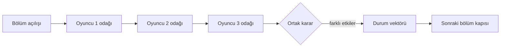

# Ortak Hikâye — ürün ve sistem tasarımı

Seçilen format: **Üç Yol, Tek Kader**

Oyuncu sayısı: tam olarak 3 insan

Oturum süresi: 30–90 dakika

Durum: uygulamaya hazır tasarım; production kodu veya migration uygulanmadı

## 1. Beş deneyim modu

### 1. Üç Yol, Tek Kader — seçilen mod

Üç oyuncu ayrı karakterleri yönetir. Her bölümde üç karakterin birer zorunlu odak sahnesi ve bütün oyuncuların gizli oy verdiği bir ortak karar vardır. Özel bilgiler ve küçük kişisel hedefler mümkündür; ana hedef ortaktır.

- **Güçlü yanı:** Her oyuncu kendi ajansına, bilgisine, envanterine ve karakter ilişkilerine sahip olur. Üçlü oy, doğal bir çoğunluk üretir.
- **Yapı:** Açılış → üç dönüşümlü odak sahnesi → ortak karar → bölüm özeti; 2–4 bölüm + final.
- **Tekrar oynanabilirlik:** Karakter arketipleri, tema paketi, kriz şablonları, gizem çözümü ve sonuç vektörü değişir.
- **Solo geliştirici maliyeti:** Orta-düşük; tek kurallar motoru ve sınırlı sahne şablonları yeterlidir.

### 2. Tek Beden, Üç Ses

Üç oyuncu aynı protagonisti paylaşır: biri niyet, biri yöntem, biri risk/tavır seçer. Çelişkili seçimler çoğunluk veya dönen “son söz” oyuncusuyla birleşir.

- **Güçlü yanı:** Tek karakter sürekliliği ve küçük state yüzeyi.
- **Risk:** Karakter sahipliği zayıf hissedilir; aynı oyuncu sürekli yöntem seçerek diğerlerini gölgede bırakabilir.
- **Uygun kullanım:** Kısa, 30 dakikalık tek seferlik macera.

### 3. Feneri Devret

Oyunculardan biri her sahnede geçici anlatıcıdır; motorun verdiği sahne iskeletinden ayrılmadan NPC tavrı veya komplikasyon seçer. Rol her sahnede döner.

- **Güçlü yanı:** Yaratıcılık ve masa oyunu hissi.
- **Risk:** Kullanıcı üretimi içerik güvenliği, süreklilik ve anlatı kalitesi değişken olur; mobil/web arayüzü karmaşıklaşır.
- **Solo geliştirici maliyeti:** Orta-yüksek.

### 4. Gizli İzler

Üç ayrı karakter ortak bir hayatta kalma hikâyesindedir; her birinin grup hedefiyle çatışmayan ama açıklamak zorunda olmadığı gizli bir anlatı hedefi bulunur.

- **Güçlü yanı:** Blöf, dramatik açıklamalar ve kişisel epiloglar.
- **Risk:** Gizli hedef mekanik ödül verirse ortak hikâye sosyal çıkarım oyununa dönüşebilir; oyuncu ihaneti kolayca rahatsız edici olur.
- **Kontrol:** Hedefler başka oyuncuya zarar veremez ve yalnız epilog/karakter yayı etkiler.

### 5. Döngü Kırıcılar

Kooperatif gizem ve zaman döngüsü birleşir. Üç karakter farklı döngülerden kalan bilgileri taşır; dünya sıfırlanırken kanonik “hatırlanan gerçekler” kalır.

- **Güçlü yanı:** Yeniden deneme anlatıya doğal olarak uyar; başarısızlık ilerleme sağlayabilir.
- **Risk:** Zaman çizgisi, bilgi erişimi ve tekrar eden sahne varyantları ilk sürüm için yüksek içerik/test maliyeti yaratır.
- **Solo geliştirici maliyeti:** Yüksek; ileride tema paketi olarak uygundur.

**Neden Üç Yol, Tek Kader?** Üç arkadaşın her birine kalıcı karakter sahipliği verir, mekanik katılımı bölüm başına eşitler ve çoğunluk kararını doğal kılar. Aynı altyapı gizem, hayatta kalma ve daha sonra zaman döngüsü temalarını taşıyabilir. Gizli hedefler çekirdek kurala değil opsiyonel katmana dönüştüğü için ilk sürüm küçük kalır.

## 2. Anlatı yapısı

### Oturum boyları

| Ayar | Yapı | Hedef süre |
|---|---|---:|
| Kısa | Açılış + 2 bölüm + final/epilog | 30–45 dk |
| Standart | Açılış + 3 bölüm + final/epilog | 50–70 dk |
| Uzun | Açılış + 4 bölüm + final/epilog | 70–90 dk |

Her normal bölüm en fazla beş mekanik sahneden oluşur: bölüm açılışı, üç odak sahnesi ve ortak karar. Gerektiğinde tek bir kısa interlude eklenebilir; motor bölüm başına sahne bütçesini aşamaz.

### Açılış

1. Host süre ve tema paketi önerir.
2. Her oyuncu kendi güvenlik tercihlerini özel olarak verir; motor her eksende en kısıtlayıcı ortak zarfı hesaplar.
3. Oyuncular sabit arketip/özellik seçeneklerinden kendi karakterlerini yaratır. Başka oyuncu birinin adını, zamirini veya sınırını belirleyemez.
4. Motor ana tehdit, ortak birincil hedef, başlangıç konumu, 1–2 gizem ve committed RNG tohumunu oluşturur.
5. LLM, yalnız bu commit edilmiş kurulumdan 250–450 kelimelik açılış yazar. Mekanik durum açılış metninden önce mevcuttur.

### Bölüm ve sahne

Her bölümün tek cümlelik açık hedefi vardır. İlk odak koltuğu bölümden bölüme döner. Bir odak sahnesi:

1. motorun uygun şablonlar arasından seçtiği bounded beat ile açılır;
2. aktif karaktere 2–4 yapılandırılmış eylem sunar;
3. oyuncu yapılandırılmış seçenek seçer veya serbest niyet yazar;
4. serbest niyet yalnız yasal eyleme yorumlanır ve oyuncuya onaylatılır;
5. motor sonucu/state diff'i commit eder;
6. sahne yazarı commit edilmiş sonucu anlatır;
7. gerekiyorsa tek fail-forward komplikasyon ve/veya anlatı sözü eklenir.

Diğer oyuncular konuşabilir, fakat aktif karakter adına mekanik seçim yapamaz. Bir yardımcı, bölümdeki tek Assist jetonunu aktif oyuncunun onayıyla kullanabilir.

### Seçimler ve sonuçlar

Her yapılandırılmış seçimin üç bölümü vardır:

- görünür yaklaşım ve risk etiketi;
- motor tarafından tanımlanmış önkoşullar;
- allowlist `effectEnvelope`.

Örnek etkiler: gerçek ekleme, karakter taşıma, eşya tüketme, ilişki ekseni ±1/±2, hedef ilerletme, gizem ilerletme, sır açıklama veya anlatı sözü ekleme. LLM bu etkileri yalnız adlandırır; maliyet/sonuç ekleyemez.

Riskli eylemler committed RNG ve sabit zorlukla `SUCCESS`, `SUCCESS_WITH_COST` veya `FAIL_FORWARD` üretir. `FAIL_FORWARD` kapıyı kapatmaz: hedefe doğru bir ilerleme olur fakat eşya hasarı, ilişki gerilimi, yeni tehdit gerçeği veya gecikmiş bir geri dönüş eklenir. Ölüm, sahneden çıkarılma ve “hiçbir şey olmadı” ilk sürüm sonucu değildir.

### Dallanma patlamasını önleme

Hikâye tam bir sahne ağacı saklamaz. “Anlatı elması” kullanır:



Seçimler sahne kimliği yerine şu kanonik boyutları değiştirir: dünya flag'leri, tehdit bandı, konum, envanter, ilişki eksenleri, hedef/gizem ilerlemesi ve açık anlatı sözleri. Sonraki bölüm motoru state predicate'lerine göre 2–4 uygun beat şablonundan birini seçer. Geçmiş seçimler callback ile hissedilir, fakat her yol ayrı yazılmış sonsuz dala dönüşmez.

Sınırlar:

- sahne başına en fazla 4 yeni gerçek;
- bölüm başına en fazla 1 yeni hedef ve 1 yeni gizem;
- aynı anda en fazla 6 açık anlatı sözü;
- bir sahne en fazla 2 sözü işler;
- bir normal seçim en fazla 5 state operation içerir;
- içerik paketi dışında yeni mekanik veya eylem türü yoktur.

### Bölüm bitişi

Üç odak oyuncusu sırasını tamamladığında ve ortak karar commit edildiğinde motor hedef/progres koşullarını kontrol eder. Bölüm `COMPLETED` olur, kanonik state özeti hesaplanır, açık ve oyuncu-özel özetler ayrı üretilir. Özet üretimi başarısız olursa motorun olay tabanlı deterministik özeti kullanılır.

### Final ve epilog

Motor oturum uzunluğu tamamlandığında veya tema paketinin açık final koşulu sağlandığında bir `EndingVector` hesaplar:

- ana hedef resolved / failed-forward / unresolved;
- tehdit düşük / orta / yüksek;
- ilişkiler birleşik / karmaşık / parçalanmış;
- gizem çözülmüş / kısmi / belirsiz;
- anlatı sözü geri ödeme oranı;
- üç karakter yayının sonucu.

Bu vektör sürümlü bir ending template seçer. LLM sonucu seçmez; yalnız template ve reveal edilebilir sırlardan final/üç epilog yazar. Başarısız final bile neyin değiştiğini, ödenen bedeli ve karakterlerin başardığını gösterir.

## 3. Durum ve eylem modeli

[`state-contract.ts`](./state-contract.ts) şu alanların tamamını tipler:

- dünya ve karakter gerçekleri;
- envanter ve konum grafiği;
- yönlü karakter ilişkileri;
- aktif/tamamlanmış/failed-forward hedefler;
- açık veya kısmen çözülmüş gizemler;
- oyuncu seçimleri ve erişim kapsamlı sırlar;
- vadeli anlatı sözleri;
- ton/güvenlik profili ve bölüm ilerlemesi.

`StoryState` yalnız backend içindir. Ortak istemci `PublicStoryView`, özel istemci `PrivateStoryView` alır. Bilgi erişimi yalnız görünürlük etiketiyle değil, kimliği doğrulanmış oyuncu/karakter bilgisi allowlist'iyle projekte edilir.

[`action-contract.ts`](./action-contract.ts) `INVESTIGATE`, `MOVE`, `TALK`, `USE_ITEM`, `ASSIST_PLAYER`, `DECEIVE`, `REVEAL_SECRET`, `REST`, `VOTE` ve `ATTEMPT_RISKY_ACTION` eylemlerini ve izinli state operation union'ını tanımlar.

### Serbest metin yorumlayıcı

1. İstemci, metni ve mevcut revizyonu `/actions/interpret` endpointine gönderir.
2. Bağlam yalnız oyuncunun gördüğü durum ve motorun ürettiği `legalActions` listesidir.
3. Yorumlayıcı sıfır, bir veya en fazla iki aday döndürür; eylem/target uyduramaz.
4. UI yapılandırılmış yorumu, varsayımları ve görünür sonuçları gösterir.
5. Oyuncu açıkça onaylarsa gerçek action token ile `/actions` çağrılır.
6. Motor üyelik, spotlight/assist hakkı, revizyon, capability, target bilgisi, önkoşul, envanter ve güvenlik zarfını yeniden doğrular.

Düşük güven veya eşit iki adayda otomatik seçim yoktur. Eşleşmeyen serbest metin, oyuncuya mevcut yapılandırılmış seçenekleri geri gösterir. LLM eylemi kendisi göndermez.

## 4. Deterministik motor ve LLM ayrımı

**Motorun tek yetkisi:** koltuk/turn sırası, spotlight ve assist bütçeleri, sahne/faz zamanları, yasal eylemler, konum/erişim, item miktarı/dayanıklılığı, flag/fact durumu, ilişki sayıları, hedef/gizem ilerlemesi, RNG, choice vote, sır audience'i, bölüm/final koşulları, save/revision ve state commit.

**LLM'nin alanı:** sahne betimlemesi, izinli NPC diyaloğu, choice/action kelimelendirmesi, duygusal süreklilik, bölüm/final anlatısı ve seyrek Party Lore esintisi. Director yalnız uygun beat/effect ID'leri arasından öneri yapar; motor doğrular.

LLM'nin `proposedStateChanges` alanı komut değildir. Her öneri allowlist union, referans görünürlüğü, sayı sınırı, safety, içerik bütçesi, süreklilik ve önkoşul doğrulamasından geçer. Reddedilen öneri state'e girmez; prose commit edilen sonuç yeniden verilmeden yayınlanmaz.

Yedi production promptu [`prompts.md`](./prompts.md) içinde ayrıdır. Model sağlayıcısı değişimine hazırlık için sabit model adı yerine `shared_story_*` mantıksal profilleri kullanılır.

## 5. Katmanlı hafıza ve süreklilik

Model hiçbir zaman bütün sohbet transkriptini almaz. Her çağrı için retrieval paketi oluşturulur:

| Katman | İçerik | Yaklaşık üst sınır |
|---|---|---:|
| Sistem + JSON şema | rol, güvenlik, çıktı sözleşmesi | 2.600 token |
| Anlık sahne | plan, son 8–12 kanonik olay, aktif eylem | 1.800 |
| Kanonik durum | ilgili gerçek/konum/item/hedef/gizem diff'i | 2.200 |
| Karakter özetleri | üç karakter için yaklaşık 450'şer | 1.350 |
| Bölüm özeti | güncel bölümün sıkıştırılmış özeti | 1.200 |
| Anlatı sözleri | açık, vadesi yaklaşan promise kayıtları | 600 |
| Ton/güvenlik | ortak zarf, hard line kategorileri | 500 |
| Party Lore | en fazla tek dönüştürülmüş referans | 400 |
| Çıktı rezervi | sahne/JSON | 3.000 |
| **Toplam hedef tavanı** | | **13.650** |

Private invocation, yalnız o oyuncunun 600 token'a kadar özel bilgisini ekler; önce lore ve dekoratif yakın geçmiş küçültülür. Tokenizer gerçek logical profile'a göre sayar. Aşım sırası:

1. lore'u çıkar;
2. dekoratif diyalog geçmişini çıkar;
3. eski sahneleri kanonik bölüm özetine sıkıştır;
4. düşük öncelikli, vadesi uzak açık sözleri yalnız ID+due ile göster.

Kanonik gerçekler, erişim kuralları, güvenlik zarfı, aktif hedefler ve yüksek öncelikli/vadesi gelen sözler hiçbir zaman bütçe için atılmaz. Özet bir gerçek kaynağı değildir; ID ile kanonik state'e referans verir. Continuity checker public/private audience başına ayrı çalışır ve erişemediği sırrı istemek yerine `UNKNOWN` döndürür.

## 6. Üç oyuncunun eşit katılımı

- Her bölümde herkesin tam bir zorunlu odak sahnesi vardır; ilk oyuncu her bölüm döner.
- Odak oyuncusu bir ana mekanik eylem yapar. Diğerleri tavsiye verebilir fakat onun adına gönderemez.
- Her oyuncu bölüm başına 2 Spotlight jetonu alır; sahne başına en fazla birini kendi follow-up'ı veya ortak sahnede karakter callback'i için kullanabilir. Jetonlar devretmez.
- Her oyuncu bölüm başına 1 Assist jetonu alır. Yalnız başka bir odakta, aktif oyuncu kabul ederse +1 destek/effect envelope açar; sonucu ele geçiremez.
- Ortak kararlarda oylar gizlidir. İki oy çoğunluktur. Üç seçenek 1–1–1 olursa 30 saniyelik iki seçenekli runoff yapılır; seçimler tema motorunun önceden tanımlı “compromise distance” ölçüsüyle en uzak seçenek elenerek belirlenir. Hâlâ eksik oy varsa bölümden bölüme dönen karar liderinin oyu belirler.
- Private seçim sonucu yalnız ilgili oyuncuya gider ve başka oyuncunun sahnesini bekletmez.
- Cevap süresi 60/90/120 saniyedir; disconnect için 90 saniye toleransından sonra motor tema paketindeki fail-forward `SAFE_DEFAULT` eylemini kullanır ve bunu açıkça işaretler.
- Director katılım ledger'ı görür; son iki sahnede konuşma/eylem odağı alamayan karaktere dekoratif diyalog ve callback önceliği verir. Bu mekanik seçim hakkını değiştirmez.

Dominance telemetry: oyuncu başına mekanik eylem sayısı, prose kelime odağı, assist kabulü, timeout ve ortak karar kazanma oranı. Oyuncu başına mekanik ana eylem sayısı bölüm sonunda eşit olmak zorundadır.

## 7. Party Lore entegrasyonu

Lore gerçek olayı kopyalamak yerine “kurmaca mesafe” dönüşümünden geçer:

- meşhur bir köprü → farklı isimli efsanevi bir geçit;
- takma ad → yalnız NPC lakabı;
- sık tekrarlanan başarısız strateji → mekanik olmayan bir duvar yazısı/geri çağırım;
- tanıdık ifade → seyrek NPC deyişi.

Kurallar:

- yalnız açık rızalı, düşük hassasiyetli ve `SHARED_STORY_FLAVOR` amaçlı kayıtlar;
- bölüm başına en fazla 1, oturum başına en fazla 3 referans;
- gerçek kişi/olay/yer doğrudan kopyalanmaz; ad, bağlam ve sonuç değiştirilir;
- kişisel şaka, sır, ilişki çatışması, ihanet, korku veya romantik baskı için kullanılmaz;
- lore mekanik gerçek, hedef, risk sonucu, NPC güvenilirliği veya gizli bilgi olamaz;
- hangi oyuncudan geldiği belirtilmez;
- rıza geri çekilince cache invalid olur ve deterministik nötr metin kullanılır.

Lore olmadan aynı seed ve eylemler aynı state değişikliklerini verir.

## 8. İçerik güvenliği ve sınırlar

Kurulumda her oyuncu tercihlerini özel gönderir. Ortak zarf her eksende en kısıtlayıcı tercihtir; kimin hangi sınırı seçtiği açıklanmaz.

| Alan | Seçenekler | Varsayılan |
|---|---|---|
| Korku | 0–3 | 1 |
| Şiddet | 0–3 | 1, grafik olmayan |
| Romantizm | kapalı / yumuşak / fade-to-black | kapalı |
| Oyuncu çatışması | kooperatif / kontrollü / yüksek+rıza | kooperatif |
| İhanet | kapalı / yalnız NPC / oyuncu opt-in | kapalı |
| Kişisel şakalar | kapalı / nazik opt-in | kapalı |
| Kara mizah | kapalı / hafif / tam opt-in | kapalı |

Hard lines ve veils serbest metin değil, sürümlü kategori/tags üzerinden seçilir; özel not gerekirse şifreli tutulur ve modele yalnız normalleştirilmiş yasak etiketi gider. Oyuncu-karakterler arası romantizm veya ihanet, genel session ayarı açık olsa bile ilgili oyuncuların sahne bazlı karşılıklı onayı olmadan üretilemez. Sessizlik onay değildir.

Her oyuncu anonim `safety/pause` çağırabilir. Kimliği yayınlanmaz; generation durur, rahatsız edici prose görünümden kaldırılıp güvenli deterministik varyantla değiştirilir. Daha önce commit edilmiş mekanik sonuçlar gizlice geri alınmaz; gerekiyorsa aynı sonucu güvenli anlatan replacement scene üretilir. Oyuncular ara verip tonu daha kısıtlayıcı yapabilir; oturum sırasında sınırlar gevşetilemez.

## 9. PostgreSQL modeli

[`schema.sql`](./schema.sql), ad çakışmasını önlemek için `shared_story` PostgreSQL şemasında istenen tabloları tanımlar:

- `story_sessions`, `story_players`, `characters`, `chapters`, `scenes`;
- `player_actions`, `story_choices`, `world_facts`, `story_goals`;
- `inventory_items`, `relationship_states`, `secrets`, `chapter_summaries`;
- `generated_story_content`.

Gerekli kanonik alanlar için ayrıca `story_locations`, `character_facts`, `story_mysteries`, `narrative_promises`, `story_choice_votes` ve `story_state_snapshots` bulunur.

Her commit revision artırır ve snapshot yazar. Pause özel bir checkpoint'tir; resume son commit'ten devam eder, ortak geçmişi geri sarmaz. Gizli state, sırlar, özel seçimler, hard lines ve private output uygulama katmanında AES-256-GCM ile şifrelidir. LLM narration state transaction dışında mevcut PostgreSQL lease/retry worker kalıbıyla çalışır.

## 10. API ve WebSocket

Komutlar kimliği doğrulanmış REST, güncellemeler kişiye özel WebSocket kullanır. Her mutasyon `Idempotency-Key`, `expectedRevision` ve action capability taşır. Model çıktısı hiçbir zaman doğrudan mutation endpointine bağlanmaz.

Akış:

1. Oda oluştur/join; aynı Nexus sunucusundan tam üç oyuncu.
2. Tema/ortak safety envelope; herkes kendi karakterini oluşturur ve ready olur.
3. Backend kurulum state'ini commit edip ilk scene job'ını oluşturur.
4. İstemci public snapshot ve ayrıca self-private snapshot alır.
5. Action interpret read-only çalışır; onaylı action transaction içinde çözülür.
6. Commit'ten sonra mekanik özet hemen yayınlanır; prose `prose.ready` ile daha sonra gelir veya fallback görünür.
7. Reconnect son sequence/revision ile 500 olaya kadar audience-filtered replay, büyük boşlukta ayrı public/private snapshot alır.
8. Host yalnız lobby ayar koordinatörüdür. Başladıktan sonra story backend'e aittir; host disconnect oyunu durdurmaz.

Create story, theme, characters, scene start, action, vote, private info, chapter advance, save/resume ve ending endpointleri ile event union'ı [`realtime-contract.ts`](./realtime-contract.ts) içindedir.

## 11. Solo geliştirici yol haritası

### Faz 0 — tek oturumluk metin prototipi

- Tek tema, 2 bölüm, 3 arketip, 12 beat ve deterministik fallback prose.
- Yerel üç oyuncu ile yapılandırılmış seçenekler; serbest metin yok.
- Geçiş: 5 test oturumunun en az 4'ü 30–60 dakikada tatmin edici final görmeli.

### Faz 1 — deterministik state

- Saf reducer, effect envelope validator, committed RNG, facts/goals/items/relationships/promises ve ending vector.
- Golden replay ve property testleri.

### Faz 2 — üç oyunculu turlar

- Spotlight rotation, assist, tokens, joint vote/runoff, timeout/fail-forward ve kişisel görünüm.

### Faz 3 — Web UI

- Lobby, karakter yaratma, sahne kartı, action tray, free-text confirmation, story log, relationship/goal drawer ve reconnect.
- AI kapalıyken tam oynanabilir fallback.

### Faz 4 — Party Lore

- Opt-in retrieval, fictionalization, kullanım bütçesi ve cache invalidation.

### Faz 5 — save/resume

- Revision snapshots, explicit pause, reconnect replay ve uzun oturumun günler sonra aynı state'ten devamı.

### Faz 6 — gizli hedefler

- Audience-scoped secrets, private scenes ve zarar veremeyen karakter-yayı hedefleri.

### Faz 7 — polish

- Gelişmiş director/writer profilleri, erişilebilirlik, ses/animasyon, recap, tema paketleri ve analytics.

## 12. İlk 10 uygulama görevi

1. `three_paths_v1` manifestini; chapter/scene/spotlight durum makinesini yaz.
2. State tiplerini Python modellerine ve saf reducer'a taşı; revision/replay iskeletini kur.
3. Allowlist effect operation validator ile precondition/visibility/bütçe kontrollerini yaz.
4. İlk `FOGBOUND_FANTASY` tema paketinde 12 beat, 3 arketip, 8 item, 6 mystery/promise ve 6 ending template oluştur.
5. Committed RNG ve `SUCCESS / SUCCESS_WITH_COST / FAIL_FORWARD` risk çözümünü ekle.
6. Üç oyunculu CLI: public görünüm, üç private görünüm, spotlight/assist/vote/runoff ve tam final.
7. Golden replay, branching bound ve 10 bin scripted-session simülasyonunu CI'a ekle.
8. PostgreSQL modelleri/Alembic migration, şifreli secret repository ve idempotent action transaction'ı yaz.
9. Public/private projector, REST/WebSocket replay ve minimal React story UI'ını oluştur.
10. Yedi LLM profilini structured output/fallback ile bağla; action interpreter ve continuity gate'i feature flag altında aç.

## 13. Test stratejisi

### Süreklilik ve state testleri

- Karakter yalnız bağlı erişilebilir konuma taşınabilir; sahne konumu ile karakter konumu çelişemez.
- Eşya sıfırın altına inemez, olmayan/başkasına özel item kullanılamaz, kaldırılmış item prose'a geri gelemez.
- Immutable gerçek değiştirilemez; disputed/retired geçişleri allowlist'tir.
- Karakter yalnız bildiği fact/secret üzerinden eylem target'ı seçebilir.
- Her proposed change operation/ID/range/bütçe/precondition ihlalinde atomik olarak reddedilir.
- Goal completion yalnız motor predicate'iyle; LLM `resolvedGoals` yazdı diye commit olmaz.
- Açık promise sayısı ≤6, vade aşımı callback/subversion ile kapanır; aynı reveal iki kez yapılamaz.

### Dallanma ve katılım

- Rastgele 10 bin legal action dizisinde bölüm başına sahne, fact, goal, mystery, promise ve effect sınırları aşılmaz.
- Her tamamlanan normal bölümde üç farklı spotlight oyuncusu tam birer kez bulunur.
- Bir oyuncu diğerinin action'ını/karakterini gönderemez; assist aktif oyuncu onayı olmadan uygulanmaz.
- 2–1, 1–1–1 runoff, eksik oy ve karar lideri tabloları deterministiktir.
- Aynı seed + actions aynı EndingVector üretir; LLM açık/kapalı sonucu değiştirmez.

### Gizlilik ve güvenlik

- A'nın public/private REST, WS, cache, replay ve model context'inde B/C secret/private fact/choice canary'leri bulunmaz.
- Public Chapter Summarizer çıktısında private addenda yoktur; her addendum yalnız sahibi için şifrelenir.
- Action Interpreter yalnız actor-visible target'ları döndürebilir.
- Safety pause kimliği broadcast/analytics'e girmez; replacement aynı committed mekanik sonucu korur.
- Prompt injection içeren player/lore/NPC metni tool/state mutation veya secret reveal üretemez.

### Token, kalite ve kurtarma

- Her logical profile için tokenizer ölçümü tavanı aşarsa belirlenen compression sırası uygulanır; canonical facts/safety/promises korunur.
- Son 3 sahneyle n-gram/embedding tekrar eşiği aşan prose bir kez yeniden üretilir, sonra fallback kullanılır.
- Continuity checker'ın false-negative seti: yanlış konum, bilinmeyen bilgi, kayıp item, ilişki tonu, ödenmemiş promise.
- LLM timeout/bozuk JSON/yanlış state önerisi sahneyi kilitlemez.
- Save/resume sonrası public/private state hash'leri, RNG counter, spotlight order ve pending choice aynı kalır.
- Duplicate action/vote aynı sonucu döndürür ve ikinci RNG çekimi/state revision üretmez.

## 14. Tam örnek bölüm

Tema: **Sisin Aldığı İsimler**. Bölüm 1: **Gri Köprünün Altı**. Ortak amaç: üçüncü çan çalmadan köprüye giriş bulmak.

Karakterler:

- Ece → **Mira**, kayıp yolları çizen Haritacı. Envanter: kömür kalemi.
- Bora → **Orin**, ses mekanizmalarını onaran Tamirci. Envanter: bakır bobin (dayanıklılık 2).
- Cem → **Lale**, unutulmuş unvanları bilen Elçi. Özel bilgi: köprü bekçisi sessizlikten korkuyor; diğerleri bunu bilmez.

Başlangıç kanoniği: şehirde üçüncü çandan sonra yazılı isimler siliniyor; Gri Köprü üst geçidi kapalı; grup Doğu Yakası'nda; İstikrar yerine tema tehdidi `fogPressure=1`; “Çanları kim çalıyor?” gizemi 0/3.

### Sahne 1 — bölüm açılışı

Motor `OPENING_BRIDGE_LOCKED` beat'ini ve açık hedefi commit eder. Scene Writer, taş korkuluklardaki isimlerin harf harf sise karıştığını ve ilk çanın uzaktan geldiğini anlatır. Yeni state değişikliği yoktur; üç yasal yaklaşım yalnız kelimelendirilir.

### Sahne 2 — Mira'nın odağı

Mira “Köprünün altındaki çizgileri kömür kalemimle kopyalamak istiyorum” yazar. Yorumlayıcı:

```json
{
  "status": "MATCHED",
  "candidates": [{
    "actionId": "act-investigate-inscriptions",
    "actionKind": "INVESTIGATE",
    "parameters": {"targetId": "bridge-inscriptions", "itemId": "charcoal-pencil"},
    "confidence": 0.96,
    "assumptions": []
  }],
  "requiresPlayerConfirmation": true,
  "explanation": "Köprü yazıtlarını kömür kalemiyle araştırma olarak yorumlandı."
}
```

Ece onaylar. Motor başarıyı commit eder:

- `ADD_FACT bridge_records_promises = true`;
- `ADVANCE_MYSTERY bell_ringer +1`;
- kömür kalemi tüketilmez;
- yeni açık promise: “Köprü alınan her sözü son çanda geri ister”, vade bölüm 3.

Yazar yalnız bundan sonra Mira'nın kâğıtta kelimeler değil, verilmiş sözlerin tarihlerini gördüğünü anlatır.

### Sahne 3 — Orin'in odağı ve fail-forward

Orin bakım kapağındaki kilidi bakır bobinle titreştirmeyi seçer. Eylem `ATTEMPT_RISKY_ACTION`, zorluk 4; committed sonuç 3 ile `FAIL_FORWARD` olur. Mira Assist jetonunu sunar, Bora kabul eder; destek kilidi açmaya yeter fakat bedeli kaldırmaz.

Commit edilen sonuç:

- bakım geçidi `accessible=true`;
- bobin dayanıklılığı 2→1;
- `fogPressure` 1→2;
- Orin→Mira güveni +1;
- açık promise: “Sisin metalik yankısı bobini daha sonra bulacak”, vade bölüm 3.

İlerleme durmaz; grup yeni yol kazanır fakat tehdit ve gelecek callback oluşur.

### Sahne 4 — Lale'nin odağı

Köprü bekçisi görünür ve “Bozuk isimlerle kimseyi geçirmem” der. Yalnız Cem'in private view'ında sessizlik korkusu bilgisi vardır. Cem `TALK` seçip “İkinci çandan sonra burada yalnız kalacağını biliyorsun; bize geçiş nişanını ver” der. Motor bilinen özel fact precondition'ını doğrular.

Sonuç `SUCCESS_WITH_COST`:

- `ADD_ITEM inkless_pass_token` Lale'ye;
- `ADD_FACT ferryman_will_open_one_gate = true` yalnız açık bilgi;
- Lale'nin özel bilgisi otomatik reveal edilmez;
- `ADD_FACT party_owes_ferryman = true` ve “borç ikinci bölümde geri döner” anlatı sözü eklenir.

### Sahne 5 — ortak karar

Motor üç seçenek sunar:

1. üst köprüye tırman — hızlı, sis riski yüksek;
2. açılan bakım geçidinden ilerle — yavaş, bobin yankısı komplikasyonu;
3. bekçinin nişanıyla ana kapıyı aç — güvenli, yeni borcu hemen tetikler.

Oylar çözülene kadar gizlidir: Ece bakım geçidi, Bora bakım geçidi, Cem ana kapı. 2–1 ile bakım geçidi seçilir.

Commit:

- üç karakter `underbridge_maintenance` konumuna taşınır;
- “köprüye giriş bul” hedefi `COMPLETED`;
- yeni ortak hedef “üçüncü çandan önce Batı Kulesi'ne ulaş”;
- bekçinin nişanı Lale'de kalır;
- bobin yankısı promise'i açık kalır.

### Bölüm özeti

Kanonik public summary:

> Mira, köprünün para değil verilmiş sözleri kaydettiğini keşfetti. Orin ve Mira bakım kilidini açtı; bakır bobin hasar gördü ve sis metalik yankıyı öğrendi. Lale bekçiden tek kullanımlık geçiş nişanı aldı ve grup ona bir karşılık borçlandı. Oyuncular bakım geçidini seçerek köprüye girdi. Çanların kaynağı hâlâ çözülmedi; ikinci bölüme iki açık geri dönüş sözü taşındı.

Private addendum yalnız Cem'e Lale'nin sessizlik bilgisinin açıklanmadığını ve hâlâ kullanılabileceğini söyler. Bölüm `closingRevision=12` ile otomatik kaydedilir; sonraki bölüm state predicate'leri bakım geçidi, yüksek sis basıncı, hasarlı bobin, bekçi borcu ve iki promise üzerinden uygun açılışı seçer.

## 15. İlk sürümden sonraya bırakılacaklar

- Sınırsız kullanıcı yapımı dünya/kurallar ve arbitrary effect scripting.
- Haftalar süren kampanyalar, karakterleri hikâyeler arasında taşıma ve çapraz-oturum ekonomi.
- Ortak geçmişi geri sarma, paralel save branch/fork ve “başka seçim ne olurdu?” modu.
- LLM'nin yeni mekanik, item özelliği veya sayısal state operation üretmesi.
- Açık PvP, zorunlu karakter ihaneti ve rekabetçi gizli skorlar.
- Oyuncu-karakterler arası romantik yaylar; ancak ayrı karşılıklı rıza tasarımı sonrası.
- Tam otonom NPC simülasyonu, canlı şehir ekonomisi ve her NPC için uzun süreli bellek.
- Sesli oyunculuk/TTS, otomatik görsel üretim ve video highlight.
- İlk web sürümü doğrulanmadan tam Discord arayüzü.
- Topluluk tema editörü/mod marketplace ve kullanıcı senaryosu güvenlik incelemesi.

Bu ertelemeler çekirdek deneyimi eksiltmez: ilk sürüm üç oyuncuya eşit ajans, kalıcı sonuç, kontrollü sırlar, save/resume, anlamlı final ve tekrar oynanabilir tema iskeleti sunar.
